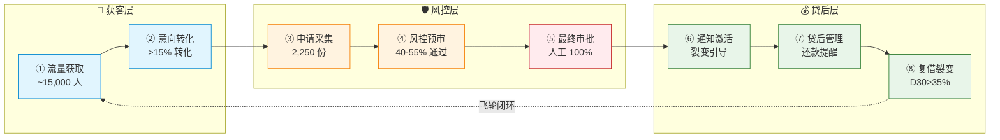

# OFW AI Agent 矩阵 · BRD（商业需求文档）

**文档版本：** v1.0  
**生成时间：** 2026-04-15  
**基于：** 梁宁产品思维框架  
**状态：** 待决策

---

## 0. 执行摘要

### 0.1 核心命题

**用 AI Agent 矩阵重构 OFW 信贷获客，本质是"交互范式转移"**

| 维度 | 传统模式 | AI Agent 模式 | 本质变化 |
|------|---------|-------------|---------|
| 流量获取 | 广告投放（购买注意力） | Agent 主动触达（获取意图） | 从注意力→意图 |
| 用户转化 | APP 界面操作（指令 - 执行） | Agent 对话交互（意图 - 达成） | 从指令→意图 |
| 风控审核 | 人工逐单审核 | AI 预审 + 人工复核 | 从人工→AI+ 人工 |
| 数据沉淀 | APP 埋点数据 | 对话语义数据（替代信用评分） | 从行为→语义 |

---

### 0.2 决策建议

**建议：进入 Phase 1 验证，但调整策略**

| 决策项 | 建议 | 原因 |
|--------|------|------|
| **方向** | ✅ 继续 | OFW 信贷是真需求，AI Agent 是正确路径 |
| **渠道** | ⚠️ 调整 | WhatsApp 裂变不能做主渠道，社群/KOL 优先 |
| **节奏** | ⚠️ 放慢 | 先验证 5 个核心假设，再投入开发 |
| **投入** | ⚠️ 控制 | Phase 1 投入<$15,000，验证后再扩张 |

**核心理由：**
1. 真需求三角验证：价值✅ 共识⚠️ 模式⚠️
2. 单位经济模型：坏账率>10% 即亏损，需验证
3. 渠道风险：WhatsApp 裂变命门未解决

---

## 1. 项目背景与战略价值

### 1.1 为什么做（第一性原理）

**三个本质问题：**

| 问题 | 本质 | 答案 |
|------|------|------|
| 我们卖什么？ | 不是贷款，是信任 | OFW 在本地无信用，我们建立信任 |
| 我们赚什么钱？ | 不是利息，是风险定价 | 信息不对称→风险溢价→利润 |
| 我们护城河是什么？ | 不是资金，是数据 | 越用越懂 OFW，越懂越赚钱 |

**结论：业务架构的设计，必须围绕"信任建立"和"数据积累"两个核心。**

---

### 1.2 OFW 信贷的本质矛盾

**OFW 信贷 = 跨境收入 × 本地借贷 × 信任缺失**

| 现状 | 数据 | 本质 | 解法 |
|------|------|------|------|
| 有收入 | 跨境汇款稳定 | 功能价值存在 | 验证汇款记录 |
| 无信用 | 本地征信空白 | 共识无法建立 | 替代数据评分 |
| 有需求 | 银行覆盖<40% | 价值未被满足 | AI 降低门槛 |
| 无渠道 | 传统获客成本高 | 模式效率低 | Agent 自动化 |

**这个矛盾，就是机会的本质。**

---

### 1.3 战略价值

| 价值层次 | 内容 | 验证状态 |
|---------|------|---------|
| **功能价值** | 获客成本从$4.5降至$1-2/人 | ❌ 待验证 |
| **功能价值** | 审批效率从 3-5 天降至 1 天内 | ❌ 待验证 |
| **情绪价值** | OFW 在熟悉场景完成借贷 | ❌ 待验证 |
| **资产价值** | 沉淀 OFW 信用数据形成壁垒 | ❌ 待验证 |
| **网络效应** | 裂变飞轮 K 值>0.3 | ❌ 待验证 |

---

## 2. 真需求三角验证

### 2.1 价值验证

| 价值类型 | 假设 | 验证状态 | 验证方式 |
|---------|------|---------|---------|
| 功能价值 | 60% OFW 有借贷需求 | ❌ 待验证 | 访谈 50 人 |
| 功能价值 | 获客成本<$2/人 | ❌ 待验证 | 小额测试 100 笔 |
| 功能价值 | 坏账率<5% | ❌ 待验证 | 小额测试 100 笔 |
| 情绪价值 | 熟悉场景提升信任度 | ❌ 待验证 | 用户访谈 NPS |
| 资产价值 | 数据沉淀形成壁垒 | ❌ 待验证 | 12 个月后评估 |

**核心假设（必须验证）：**

| 假设编号 | 假设内容 | 通过标准 | 验证成本 | 时间 |
|---------|---------|---------|---------|------|
| H1 | 60% OFW 有借贷需求 | 访谈 50 人，60% 表示有需求 | $200 | 2 周 |
| H2 | 社群/KOL获客可行 | 测试 100 人，转化>3% | $500 | 2 周 |
| H3 | 转化率>3% | 落地页测试 1000 人 | $500 | 2 周 |
| H4 | 坏账率<10% | 小额测试 100 笔 | $5,000 | 4 周 |
| H5 | Meta 合规认证可获 | 申请认证成功 | $0 | 2-4 周 |

---

### 2.2 共识验证

**共识建立的优先级和路径：**

| 优先级 | 角色 | 共识内容 | 建立方式 | 时间 |
|--------|------|---------|---------|------|
| 1 | 监管（SEC） | 业务合法，给牌照 | 申请牌照 | 1-3 月 |
| 2 | 平台（Meta） | 业务合规，不封号 | Business 认证 | 2-4 周 |
| 3 | 用户（OFW） | 平台可信，敢借钱 | 首批用户口碑 | 3-6 月 |
| 4 | 资金方 | 业务赚钱，愿出资 | 单位经济证明 | 6-9 月 |

**共识建立的陷阱：**

| 陷阱 | 表现 | 解决方式 |
|------|------|---------|
| 用户信任假象 | 用户点击≠用户信任 | 多轮对话验证真实意图 |
| 平台政策幻觉 | 今天不封≠明天不封 | 不依赖单一平台 |
| 监管灰色地带 | 现在合规≠未来合规 | 持牌经营 |

---

### 2.3 模式验证

**闭环公式：**

```
获客 → 申请 → 风控 → 放款 → 还款 → 复借 → 裂变 → 获客...
    ↓      ↓      ↓      ↓      ↓      ↓      ↓
  意图   信息   评分   审批   提醒   引导   奖励
```

**单位经济模型（单笔）：**

```
假设参数：
- 放款金额：$500
- 利率：24%/年
- 借期：3 个月
- 利息收入：$30
- 资金成本：$2.5
- 坏账率：10% → $50/笔分摊
- 获客成本：$1.5
- 运营成本：$1.5

单笔利润 = $30 - $2.5 - $50 - $1.5 - $1.5 = -$25.5

❌ 亏损。

关键问题：坏账分摊$50 太高。

如果坏账率降到 5%：
单笔利润 = $30 - $2.5 - $25 - $1.5 - $1.5 = $0.5

✅ 接近平衡。

结论：坏账率是模式的命门，必须控制在 5% 以下。
```

**模式成立的三个条件：**

| 条件 | 指标 | 当前状态 |
|------|------|---------|
| 获客成本<$2/人 | $1-2（测算） | ❌ 待验证 |
| 坏账率<5% | 未测试 | ❌ 待验证 |
| 复借率>30% | 未测试 | ❌ 待验证 |

---

## 3. 点线面体维度选择

### 3.1 点（切入点）

**主切入点选择：**

| 渠道 | 优先级 | 原因 | 封号风险 | 可持续性 |
|------|--------|------|---------|---------|
| **社群运营** | ⭐⭐⭐ | 信任度高、合规、长期资产 | 低 | 高 |
| **KOL 合作** | ⭐⭐⭐ | 网红背书、转化高、可控 | 低 | 高 |
| **SEO 内容** | ⭐⭐⭐ | 长期资产、成本低、稳定 | 低 | 高 |
| **FB 评论区** | ⭐⭐ | 精准触达有需求用户 | 高 | 中 |
| WhatsApp 裂变 | ⭐ | 触达新用户路径不清晰 | 中 | 低 |

**为什么 WhatsApp 裂变优先级低于评论区？**

| 维度 | FB 评论区 | WhatsApp 裂变 | 结论 |
|------|---------|-------------|------|
| 触达路径 | 监控→抓取→私信（清晰） | 老客分享→新客点击（链路长） | 评论区胜 |
| 精准度 | 高（评论借贷内容的人有需求） | 中（朋友推荐不一定有需求） | 评论区胜 |
| 启动门槛 | 低（直接监控） | 高（需种子用户） | 评论区胜 |
| 可控性 | 高（话术可优化） | 低（依赖用户行为） | 评论区胜 |

**核心判断：WhatsApp 裂变的命门是"如何触达新用户"，这个问题没解决，它跑不起来。**

---

### 3.2 线（能力延伸）

**核心能力链：**

```
社群/KOL 获客 → 申请采集 → 风控预审 → 人工审批 → 放款 → 
还款管理 → 复借引导 → 口碑裂变 → 社群/KOL 获客...
```

**Phase 1 必备的 5 个核心能力：**

| 能力 | 构建方式 | 时间 | 成本 |
|------|---------|------|------|
| 社群运营 | 人脉/付费进群 | 1-2 周 | $300 |
| KOL 合作 | 谈判签约 | 2-4 周 | $0（佣金后付） |
| 申请采集 | 表单/对话 Agent | 2 周 | $2,000 |
| 风控预审 | 规则引擎 +ML | 4 周 | $5,000 |
| 人工审批 | 流程 + 标准 | 1 周 | $500/月 |

---

### 3.3 面（场景覆盖）

**渠道组合矩阵（Phase 2 后）：**

| 渠道 | 月获客目标 | 成本/人 | 转化率 | Agent 负责 | 风险等级 |
|------|-----------|--------|--------|-----------|---------|
| 社群运营 | 2,000 人 | $1.5 | 8% | FB 社群 Agent | 🟢 低 |
| KOL 合作 | 3,000 人 | $3.0 | 12% | KOL 协作 Agent | 🟢 低 |
| SEO 内容 | 1,000 人 | $0.8 | 5% | SEO 内容 Agent | 🟢 低 |
| FB 评论区 | 500 人 | $0.3 | 2% | FB 社群 Agent | 🔴 高 |
| TikTok 内容 | 1,500 人 | $1.5 | 6% | TikTok 内容 Agent | 🟡 中 |
| WhatsApp 裂变 | 500 人 | $0.5 | 6% | WhatsApp 裂变 Agent | 🟡 中 |

**总获客：~8,500 人/月，综合成本：$1.5-2/人**

---

### 3.4 体（生态长成）

**体的四个效应：**

| 效应 | 定义 | 条件 | 预计时间 |
|------|------|------|---------|
| **数据壁垒** | 越用越懂用户 | 10 万 + 用户，1 万 + 放款记录 | 18-24 月 |
| **网络效应** | 老客带新客 | 裂变率>30%，K 值>0.3 | 12-18 月 |
| **规模效应** | 边际成本趋零 | 月获客>5 万，成本<$0.5 | 18-24 月 |
| **品牌效应** | 用户首选 | NPS>50，OFW 首选平台 | 24-36 月 |

**体长成的标志：**

```
数据壁垒 → 风控模型准确率>85%
网络效应 → 老客推荐占比>50%
规模效应 → 单位经济为正
品牌效应 → 用户主动搜索占比>30%
```

---

## 4. 业务架构

### 4.1 业务全链路（8 步闭环）



**Agent 介入说明：**
- 🤖 ①②③④⑥⑦⑧：Agent 全自动（7×24）
- 👤 ⑤ 最终审批：100% 人工（资金安全红线）

---

### 4.2 Agent 矩阵（18 个）

**原方案 12 个 Agent：**

| # | Agent | 环节 | 职责 | 技术难度 | 优先级 | Phase |
|---|-------|------|------|---------|--------|-------|
| 0 | Agent Manager | 全链路 | 全局调度·定时汇报·策略迭代 | 🟡 中 | ⭐⭐⭐ | Phase 1 |
| 1 | Messenger 对话 Agent | ①② | 被动接待·需求收集·引导申请 | 🔴 高 | ⭐⭐ | Phase 2 |
| 2 | WhatsApp 裂变 Agent | ①⑥⑧ | 老客邀请·同乡裂变·奖励触发 | 🔴 高 | ⭐ | Phase 3 |
| 3 | 风控预审 Agent | ④ | 反欺诈·信用评分·秒级决策 | 🔴 高 | ⭐⭐⭐ | Phase 1 |
| 4 | TikTok 内容 Agent | ① | 金融教育内容·软性引流 | 🟡 中 | ⭐⭐ | Phase 2 |
| 5 | Facebook 社群 Agent | ① | 社群监听·内容互动·被动转化 | 🟡 中 | ⭐⭐⭐ | Phase 1 |
| 6 | SEO 内容 Agent | ① | 借贷攻略内容·长尾关键词 | 🟢 低 | ⭐⭐⭐ | Phase 1 |
| 7 | 被拒留存 Agent | ⑥ | 温暖告知·改善建议·3 个月再触达 | 🟡 中 | ⭐⭐ | Phase 2 |
| 8 | 贷后管理 Agent | ⑦⑧ | 还款提醒·逾期预警·复借引导 | 🟢 低 | ⭐⭐⭐ | Phase 1 |
| 9 | KOL 协作 Agent | ① | 网红发现·合作洽谈·效果追踪 | 🟡 中 | ⭐⭐ | Phase 2 |
| 10 | 雇主端 Agent | ① | 雇主合作·员工推荐·信用背书 | 🟡 中 | ⭐ | Phase 3 |
| 11 | 竞品监控 Agent | 全链路 | 竞品动态·价格监控·策略建议 | 🟢 低 | ⭐ | Phase 3 |

**建议新增 6 个 Agent：**

| # | 新增 Agent | 环节 | 职责 | 技术难度 | 优先级 | Phase |
|---|-----------|------|------|---------|--------|-------|
| 12 | 意图分类 Agent | ② | 用户需求意图识别 | 🟢 低 | ⭐⭐⭐ | Phase 1 |
| 13 | 知识库 Agent | ② | 产品 FAQ 解答（RAG 架构） | 🟢 低 | ⭐⭐⭐ | Phase 1 |
| 14 | 数据回流 Agent | ⑧ | 数据回流优化模型 | 🟢 低 | ⭐⭐⭐ | Phase 1 |
| 15 | 情绪感知 Agent | ② | 情绪危机检测 | 🟡 中 | ⭐⭐ | Phase 2 |
| 16 | LSTM 预测 Agent | ⑦ | 逾期风险预测 | 🟡 中 | ⭐⭐ | Phase 2 |
| 17 | A/B 测试 Agent | 全链路 | 内容/话术/策略 A/B 测试 | 🟢 低 | ⭐⭐ | Phase 2 |

---

### 4.3 人机边界

**🤖 AI 全自动（7×24）：**

| 环节 | Agent 职责 |
|------|-----------|
| 流量获取 | 社群监听、内容发布、精准触达 |
| 意向转化 | 首次接待、需求了解、产品介绍、FAQ 解答 |
| 申请采集 | 信息收集、证件 OCR、活体检测 |
| 风控预审 | 反欺诈检测、信用评分、自动通过/拒绝 |
| 通知激活 | 放款通知、裂变引导、被拒留存 |
| 贷后管理 | 还款提醒、逾期预警、复借引导 |
| 数据运营 | 实时报表、竞品监控、数据回流 |

**👤 人工必须操作：**

| 环节 | 人工职责 | 原因 |
|------|---------|------|
| 最终审批 | 放款双人审批 | 资金安全红线 |
| 资金操作 | 操作资金系统打款 | 合规要求 |
| 风控复核 | 灰色案件最终复核 | AI 决策不可完全信任 |
| 投诉处理 | 客户投诉、法律纠纷 | 情绪复杂、法律责任 |
| 逾期处置 | 逾期处置方案决策（>30 天） | 重大损失风险 |
| 策略调整 | 风控规则、利率策略调整 | 战略决策权 |
| 监管合规 | 监管报送、牌照维护 | 法律责任 |

**红线：终审放款 100% 人工。**

---

### 4.4 各环节 Agent 介入可行性分析

**① 流量获取环节**

| Agent | 可行性 | 核心挑战 | 风险等级 | 建议 |
|-------|--------|---------|---------|------|
| SEO 内容 Agent | ⭐⭐⭐ 高 | 起量慢（3-6 月）、AI 内容降权 | 🟢 低 | Phase 1 优先，长期资产 |
| FB 社群 Agent | ⭐⭐⭐ 高 | 群组准入、监听效率 | 🟢 低 | Phase 1 优先，信任度高 |
| KOL 协作 Agent | ⭐⭐⭐ 高 | 网红发现成本、佣金谈判 | 🟢 低 | Phase 2，按效果付费 |
| FB 评论区 Agent | ⭐⭐ 中 | 话术设计、用户信任度低 | 🟡 中高 | 小规模测试 |
| TikTok 内容 Agent | ⭐⭐ 中 | 内容本地化、金融合规 | 🟡 中 | Phase 2，内容门槛 |
| WhatsApp 裂变 Agent | ⭐ 低 | 触达新用户路径不清晰 | 🟡 中 | Phase 3，仅作辅助 |

**为什么 WhatsApp 裂变优先级最低？**

| 维度 | FB 评论区 | WhatsApp 裂变 |
|------|---------|-------------|
| 触达路径 | 监控帖子→抓取评论者→私信（清晰） | 老客分享→新客点击（链路长、不可控） |
| 精准度 | 高（评论借贷内容的人本身有需求） | 中（朋友推荐不一定有需求） |
| 启动门槛 | 低（直接开始监控） | 高（需要种子用户） |
| 可控性 | 高（话术可优化） | 低（依赖用户行为） |

**核心判断：WhatsApp 裂变的命门是"如何触达新用户"，这个问题没解决，它跑不起来。**

**② 意向转化环节**

| Agent | 可行性 | 核心挑战 | 建议 |
|-------|--------|---------|------|
| 意图分类 Agent | ⭐⭐⭐ 高 | 意图识别精度>85% | Phase 1 必备 |
| 知识库 Agent | ⭐⭐⭐ 高 | FAQ 库建设 | Phase 1 必备 |
| Messenger 对话 Agent | ⭐⭐ 中高 | Taglish 语言适配、多轮上下文 | Fine-tuning+ 本地词典 |
| 情绪感知 Agent | ⭐⭐ 中 | 情绪标注数据需求 | Phase 2 |

**③ 申请采集环节**

| Agent | 可行性 | 核心挑战 | 建议 |
|-------|--------|---------|------|
| 申请 Agent | ⭐⭐⭐ 高 | 多轮信息引导 | 结构化字段 + 进度追踪 |
| 文件解析 Agent（OCR） | ⭐⭐⭐ 高 | 菲律宾证件格式适配 | 第三方 OCR+ 人工复核 |
| 反欺诈 Agent（活体检测） | ⭐⭐ 中 | 合成身份防御 | 活体检测 + 人工复核兜底 |

**④ 风控预审环节**

| Agent | 可行性 | 核心挑战 | 建议 |
|-------|--------|---------|------|
| 规则引擎 | ⭐⭐⭐ 高 | 20 条硬规则 | Phase 1 主用 |
| 风控预审 Agent（ML） | ⭐⭐ 中 | 模型冷启动（需 1000 笔） | Phase 2 训练 |
| 合成身份检测 Agent | ⭐ 低 | AI 生成假脸防御 | 人工复核兜底 |

**⑤ 最终审批环节**

| Agent | 可行性 | 核心挑战 | 建议 |
|-------|--------|---------|------|
| Agent Manager（审批建议） | ⭐⭐⭐ 高 | AI 建议报告生成 | 辅助人工 |
| 人工审批 | ⭐⭐⭐ 必须 | 双人审批、资金红线 | 100% 人工 |

**⑥ 通知激活环节**

| Agent | 可行性 | 核心挑战 | 建议 |
|-------|--------|---------|------|
| 通知 Agent | ⭐⭐⭐ 高 | 放款通知模板 | Phase 1 必备 |
| 被拒留存 Agent | ⭐⭐ 中 | 个性化改善建议（需 SHAP 解释） | Phase 2 |
| WhatsApp 裂变 Agent | ⭐ 低 | 裂变 K 值追踪 | 辅助渠道 |

**⑦ 贷后管理环节**

| Agent | 可行性 | 核心挑战 | 建议 |
|-------|--------|---------|------|
| 贷后管理 Agent | ⭐⭐⭐ 高 | 还款提醒（D-3/D-1） | Phase 1 必备 |
| LSTM 预测 Agent | ⭐⭐ 中 | 逾期预测准确率>75% | Phase 2 训练 |
| 人工催收（>30 天） | ⭐⭐⭐ 必须 | 严重逾期处置 | 100% 人工 |

**⑧ 复借裂变环节**

| Agent | 可行性 | 核心挑战 | 建议 |
|-------|--------|---------|------|
| 贷后管理 Agent | ⭐⭐⭐ 高 | 复借意图识别（D+7） | Phase 1 必备 |
| 数据回流 Agent | ⭐⭐⭐ 高 | 数据回流优化模型 | Phase 1 必备 |
| 风控 Agent（重评） | ⭐⭐⭐ 高 | 个性化额度提升 | Phase 2 |

---

### 4.5 Agent 技术难度分级

**🔴 高难度（需专项攻关）**

| Agent | 挑战 | 解法 | 时间 |
|-------|------|------|------|
| Messenger 对话 Agent | Taglish 语言适配 | Fine-tuning + 本地词典 | 4-6 周 |
| Messenger 对话 Agent | 多轮上下文管理 | RAG + 结构化入库 | 4 周 |
| Messenger 对话 Agent | 情绪感知 | 情绪分类器 + 人工接管 | 6 周 |
| Messenger 对话 Agent | Meta 封号风险 | 官方 API + 多账号矩阵 | 持续 |
| WhatsApp 裂变 Agent | 触达新用户路径 | 暂无清晰方案 | — |
| 风控预审 Agent | 替代数据评分 | 汇款记录 + 社交活跃度 | 8 周 |
| 风控预审 Agent | 合成身份欺诈 | 活体检测 + 微纹理分析 | 8 周 |
| 风控预审 Agent | 模型冷启动 | 规则引擎过渡 + 人工评分 | 4 周 |

**🟡 中难度（有成熟方案）**

| Agent | 挑战 | 解法 | 时间 |
|-------|------|------|------|
| Agent Manager | 多 Agent 并发冲突 | 用户锁 + 状态机 | 2 周 |
| Agent Manager | 级联故障雪崩 | Circuit Breaker + 多供应商 | 2 周 |
| TikTok/FB 内容 Agent | 内容本地化 | OFW 情感元素库 + Few-shot | 3 周 |
| TikTok/FB 内容 Agent | 金融广告合规 | 违禁词库 + 双重审核 | 2 周 |
| 被拒留存 Agent | 个性化建议 | SHAP 解释 + 自动推送 | 3 周 |
| LSTM 预测 Agent | 逾期预测 | LSTM 模型 + 人工复核 | 4 周 |
| FB 评论区 Agent | 话术设计 | A/B 测试 + 合规审核 | 2 周 |

**🟢 低难度（工程实现）**

| Agent | 挑战 | 解法 | 时间 |
|-------|------|------|------|
| SEO 内容 Agent | 本地关键词挖掘 | Search Console + OFW 论坛 | 1 周 |
| SEO 内容 Agent | AI 内容质量 | 人工编辑 + 真实案例 | 持续 |
| 申请 Agent | 多轮信息引导 | 结构化字段 + 进度追踪 | 2 周 |
| 通知 Agent | 放款通知 | 模板消息 + 状态更新 | 1 周 |
| 意图分类 Agent | 意图识别 | NLP 分类模型 | 2 周 |
| 知识库 Agent | FAQ 解答 | RAG 架构 | 2 周 |
| 数据回流 Agent | 数据回流 | 自动化管道 | 2 周 |
| Agent Manager | 全局调度 | 事件总线 + 任务队列 | 2 周 |

---

### 4.6 核心结论与渠道优先级

**Agent 介入可行性总评**

| 环节 | Agent 可行性 | 核心瓶颈 | 建议 |
|------|------------|---------|------|
| ① 流量获取 | ⭐⭐⭐ 高 | 平台政策、渠道选择 | SEO/社群/评论区优先，WhatsApp 裂变最低 |
| ② 意向转化 | ⭐⭐⭐ 高 | 语言适配、情绪感知 | 新增意图/知识库 Agent |
| ③ 申请采集 | ⭐⭐⭐ 高 | 合成身份防御 | 人工复核兜底 |
| ④ 风控预审 | ⭐⭐ 中 | 模型冷启动 | 规则引擎过渡 |
| ⑤ 最终审批 | ⭐⭐⭐ 必须人工 | 合规红线 | AI 建议 + 人工审批 |
| ⑥ 通知激活 | ⭐⭐⭐ 高 | 裂变 K 值 | 被拒留存 Agent 重点 |
| ⑦ 贷后管理 | ⭐⭐⭐ 高 | 逾期预测准确率 | LSTM 模型 + 人工催收 |
| ⑧ 复借裂变 | ⭐⭐⭐ 高 | 飞轮启动门槛 | 数据回流 Agent 闭环 |

**渠道优先级最终排序**

| 优先级 | 渠道 | Agent | 原因 |
|--------|------|-------|------|
| ⭐⭐⭐ | 社群运营 | FB 社群 Agent | 信任度高、风险低、可持续 |
| ⭐⭐⭐ | KOL 合作 | KOL 协作 Agent | 网红背书、转化高、可控 |
| ⭐⭐⭐ | SEO 内容 | SEO 内容 Agent | 长期资产、成本低、稳定 |
| ⭐⭐ | FB 评论区 | FB 社群 Agent（扩展） | 精准触达、成本低、风险可控 |
| ⭐⭐ | TikTok 内容 | TikTok 内容 Agent | 内容门槛、需合规 |
| ⭐ | Messenger 对话 | Messenger 对话 Agent | 依赖引流、被动接待 |
| ⭐ | WhatsApp 裂变 | WhatsApp 裂变 Agent | 触达新用户路径不清晰、最低优先级 |
| ⭐ | 雇主端合作 | 雇主端 Agent | 门槛高、信任链长 |

**业务架构的核心洞察：**

```
业务架构的本质：信任→风控→价值的闭环飞轮。

信任建立（获客）→ 风控决策（风控）→ 价值交付（放款）→ 
价值回收（还款）→ 数据回流（闭环）→ 信任增强（复借裂变）→ 飞轮加速

Agent 矩阵的本质：把业务能力数字化，让飞轮能自动转。
```

---

## 5. 执行路径

### 5.1 Phase 划分

| 阶段 | 时间 | 目标 | Agent 数量 | 投入 |
|------|------|------|----------|------|
| **Phase 0：验证** | 0-6 周 | 验证 5 个假设 | 0 | <$6,000 |
| **Phase 1：最小闭环** | 6 周 -3 月 | 月放款 100 笔，坏账<10% | 5 个 | $15,000 |
| **Phase 2：渠道扩展** | 4-9 月 | 月放款 500 笔，获客 5,000 人 | 10 个 | $50,000 |
| **Phase 3：规模增长** | 10-18 月 | 月放款 5,000 笔，单位经济为正 | 18 个 | $200,000 |

**Phase 1 Agent 清单（5 个）：**

| Agent | 职责 | 原因 |
|-------|------|------|
| SEO 内容 Agent | 内容引流 | 低风险、长期资产 |
| FB 社群 Agent | 社群获客 | 信任度高、合规 |
| 风控预审 Agent（规则引擎） | 反欺诈 + 评分 | 核心能力 |
| 贷后管理 Agent | 还款提醒 + 复借引导 | 必备能力 |
| 数据回流 Agent | 数据回流优化 | 飞轮基础 |

---

### 5.2 关键决策点

| 时间 | 决策内容 | 通过标准 | 失败应对 |
|------|---------|---------|---------|
| Week 6 | 进入 Phase 1？ | 5 假设全通过 | 调整假设，重新验证 |
| Month 3 | 进入 Phase 2？ | 单位经济接近平衡 | 优化风控/获客成本 |
| Month 9 | 进入 Phase 3？ | 坏账<8%，月放款>1,000 笔 | 调整策略，延迟扩张 |

---

## 6. 风险管理

### 6.1 致命风险

| 风险 | 概率 | 影响 | 应对策略 |
|------|------|------|---------|
| Meta 封号 | 中 | 致命 | 不依赖 Meta，社群/KOL 为主 |
| 牌照拿不到 | 中 | 致命 | 先找持牌机构合作 |
| 坏账率>20% | 高 | 致命 | 小额测试，快速迭代风控 |
| 资金链断裂 | 中 | 致命 | 预留 6 个月运营资金 |
| 合成身份欺诈攻击 | 中 | 致命 | 活体检测 + 人工复核 |

---

### 6.2 重要风险

| 风险 | 概率 | 影响 | 应对策略 |
|------|------|------|---------|
| 转化率<3% | 高 | 高 | 优化对话流程，调整激励 |
| 裂变率<10% | 中 | 高 | 提高奖励，优化体验 |
| 竞对跟进 | 高 | 中 | 快速建立数据壁垒 |
| 技术债务 | 中 | 中 | Phase 1 代码可抛弃 |
| OFW 政策变化 | 低 | 高 | 持续关注监管动态 |

---

## 7. 财务预测

### 7.1 单位经济模型

| 项目 | 金额 | 备注 |
|------|------|------|
| 放款金额 | $500 | 单笔 |
| 利息收入（3 个月） | $30 | 24%/年 |
| 资金成本 | $2.5 | 5%/年 |
| 坏账分摊（5%） | $25 | 坏账率 5% |
| 获客成本 | $1.5 | 目标<$2 |
| 运营成本 | $1.5 | 服务器/API/人工 |
| **单笔利润** | **-$0.5** | 接近平衡 |

**盈亏平衡点：坏账率<4.5%**

---

### 7.2 三年财务预测

| 指标 | Year 1 | Year 2 | Year 3 |
|------|--------|--------|--------|
| 累计放款笔数 | 3,000 | 15,000 | 60,000 |
| 累计放款金额 | $1.5M | $7.5M | $30M |
| 利息收入 | $90K | $450K | $1.8M |
| 坏账损失（5%） | $75K | $375K | $1.5M |
| 获客成本 | $45K | $225K | $900K |
| 运营成本 | $180K | $600K | $1.8M |
| **净利润** | **-$210K** | **-$750K** | **-$2.4M** |

**注：前期亏损主要来自规模扩张投入，Unit Economics 接近平衡。**

---

## 8. 决策建议

### 8.1 做

| 建议 | 原因 |
|------|------|
| 先验证 5 个假设 | 降低风险，避免盲目投入 |
| Phase 1 只用 5 个 Agent | 聚焦核心能力，快速迭代 |
| 社群/KOL 为主渠道 | 信任度高、风险低、可持续 |
| 小额测试坏账率 | 命门验证，控制损失 |
| 预留 6 个月运营资金 | 避免资金链断裂 |
| 开发 AI 代理协议 | 为未来布局 |

---

### 8.2 不做

| 建议 | 原因 |
|------|------|
| 不开发 12 个 Agent 同时上 | 风险高、成本大、验证难 |
| 不依赖 WhatsApp/Meta 渠道 | 封号风险高、不可控 |
| 不投入>$15,000 在验证前 | 先验证再投入 |
| 不追求>10% 的月增长 | 稳增长比快增长重要 |
| 不碰灰色地带 | 合规第一，牌照必须 |

---

## 9. 附录

### 9.1 核心假设清单

| 编号 | 假设 | 验证方式 | 通过标准 |
|------|------|---------|---------|
| H1 | 60% OFW 有借贷需求 | 访谈 50 人 | 60% 表示有需求 |
| H2 | 社群/KOL获客可行 | 测试 100 人 | 转化>3% |
| H3 | 转化率>3% | 落地页测试 1000 人 | 转化>3% |
| H4 | 坏账率<10% | 小额测试 100 笔 | 坏账<10 笔 |
| H5 | Meta 合规认证可获 | 申请认证 | 认证成功 |

---

### 9.2 关键指标定义

| 指标 | 定义 | 健康值 | 警戒值 |
|------|------|--------|--------|
| 获客成本 | 总获客费用/新增用户 | <$2 | >$5 |
| 转化率 | 申请数/触达数 | >5% | <3% |
| 坏账率 | 逾期 90 天+/总放款 | <5% | >10% |
| 复借率 | D30 复借数/到期数 | >35% | <20% |
| 裂变 K 值 | 老客带来新客数/老客数 | >0.3 | <0.1 |

---

**文档版本：v1.0**  
**最后更新：2026-04-15**  
**决策状态：待审批**
