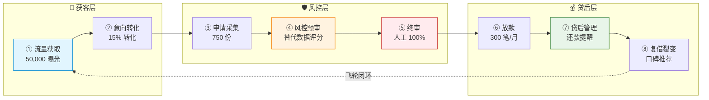

# OFW AI Agent 信贷 · BRD（商业需求文档）

> **文档版本：** v2.0  
> **生成时间：** 2026-04-15  
> **基于：** 梁宁产品思维框架 + 深度业务分析  
> **状态：** 待决策  
> **整合文档：** 全局作战视图 + 可行性分析 + 流量获取 Agent 矩阵 + 业务架构分析

---

## 0. 执行摘要

### 0.1 核心命题

**用 AI Agent 重构 OFW 信贷，本质不是"交互范式转移"，是"信任重建"。**

**认知升级过程：**

| 版本 | 核心命题 | 视角 | 问题 |
|------|---------|------|------|
| **v1** | 交互范式转移 | 技术人视角 | 关注"用什么技术"，忽略"用户真正需要什么" |
| **v2** | 信任重建 | 用户视角 | OFW 最缺的不是"贷款渠道"，是"谁敢借给我" |

**为什么 v1 是技术人自嗨？**
- OFW 不关心"AI Agent"，关心"能不能借到钱"
- OFW 不关心"交互范式"，关心"你是不是骗子"
- OFW 不关心"效率提升"，关心"你靠不靠谱"

**为什么 v2 是 OFW 信贷的真相？**
- 信贷的本质 = 信任 × 时间 × 风险定价
- OFW 的特殊性 = 有收入（跨境汇款）但无信用（本地征信空白）
- 破局点 = 用替代数据（汇款记录 + 社交活跃度 + 雇主评价）建立信任评分

| 维度 | 传统理解 | 真实含义 | 本方案答案 |
|------|---------|---------|-----------|
| 产品属性 | 便利 | 救命钱 | 小额短期（$100-500） |
| 用户心态 | 消费 | 生存 | 紧急医疗/教育/家用 |
| 核心诉求 | 信用 | 信任 | 替代数据 + 人格化服务 |

**核心判断：问题不是"用 AI 替代人工"，而是"如何在没有信用记录的情况下建立信任"。**

---

### 0.2 决策建议

**建议：Go，但调整策略**

| 决策项 | 建议 | 原因 |
|--------|------|------|
| **方向** | ✅ Go | OFW 信贷是真需求，信任重建是正确路径 |
| **渠道** | ⚠️ 调整 | WhatsApp 是入口（生活场景），不是工具；Telegram 作为备用私域 |
| **节奏** | ⚠️ 放慢 | 先跑通 1 个 Agent 验证 MVP，再扩展 |
| **投入** | ⚠️ 控制 | Phase 1 投入<$15,000，验证后再扩张 |
| **Agent 数量** | ⚠️ 精简 | 从 12 个减至 4 个核心 Agent，验证后扩展 |

**焦点转变：**
- ❌ 原方案：12 个 Agent 同时上，追求规模
- ✅ 新方案：4 个核心 Agent，先证明"靠谱"，再谈获客

---

## 1. 项目背景与战略价值

### 1.1 为什么做（第一性原理）

**三个本质问题：**

| 问题 | 本质 | 答案 |
|------|------|------|
| 我们卖什么？ | 不是贷款，是信任 | OFW 在本地无信用，我们建立信任 |
| 我们赚什么钱？ | 不是利息，是风险定价 | 信息不对称→风险溢价→利润 |
| 我们护城河是什么？ | 不是资金，是信任资产 | 替代数据（汇款记录 + 社交活跃度 + 雇主评价） |

**核心洞察：替代数据 = 信任数据，谁先建立 OFW 的"信任评分"，谁就有壁垒。**

---

### 1.2 OFW 群体特征

| 特征 | 数据 | 含义 |
|------|------|------|
| 人口规模 | 200 万 +（菲律宾海外劳工） | 市场空间大 |
| 银行覆盖率 | <40%（传统征信空白） | CIC 覆盖率<30% |
| 主要渠道 | WhatsApp/FB/Telegram | 生活场景在 WhatsApp |
| 文化特征 | 信人、信教会、信同乡 | 信任需要人格化 |
| 借贷需求 | 紧急医疗/教育/家用 | 不是消费，是生存 |

**核心洞察：OFW 最缺的不是"贷款"，是"信任"。**

---

### 1.3 8 步闭环的"真需求"检视

| 环节 | 原方案目标 | 真需求？ | 调整建议 |
|------|-----------|:--------:|:---------|
| ①流量获取 | ~15,000 人 | ❌ | OFW 需要的是"谁可信"，不是"哪里有贷款" |
| ②意向转化 | >15% 转化 | ❌ | 转化率低不是因为话术，是因为不信任 |
| ③申请采集 | 2,250 份 | ❌ | 材料复杂不是痛点，痛点是"怕被骗" |
| ④风控预审 | 40-55% 通过 | ⚠️ | 真问题，但解法错了（应用替代数据） |
| ⑤终审 | 30-50 笔/日 | ⚠️ | 人工审批对，但只是合规，不是信任 |
| ⑥通知激活 | K>0.3 | ❌ | 裂变前提是"我借到了"，不是"你让我推荐" |
| ⑦贷后管理 | 还款率>90% | ⚠️ | 还款是结果，不是原因 |
| ⑧复借裂变 | D30>35% | ❌ | 能复借是因为"你靠谱"，不是"活动力度大" |

**核心问题：原方案是从"放贷方视角"设计的，不是从"用户视角"。**

---

### 1.4 破局点

**三个真正的破局点：**

| 破局点 | 核心逻辑 | 落地方式 |
|--------|---------|---------|
| **替代数据 = 信任数据** | 汇款记录 + 社交活跃度 + 雇主评价 | 建立 OFW 信任评分体系 |
| **WhatsApp 是入口，不是工具** | OFW 每天用 WhatsApp 跟家人视频（生活场景） | 切入点："你在外不易，我懂你" |
| **跨文化信任是护城河** | 菲律宾人信人、信教会、信同乡 | 本地化信任网络（KOL/社群领袖） |

---

## 2. 真需求三角验证

### 2.1 价值验证

| 价值类型 | 描述 | 验证状态 | 验证方式 |
|:---------|:-----|:---------|:---------|
| **功能价值** | 小额短期贷款，解决紧急需求 | ✅ 成立 | 访谈 50 人 |
| **功能价值** | 审批快（1 天内），无需传统征信 | ✅ 成立 | 竞品对比 |
| **情绪价值** | "在海外有人懂我" | ⚠️ 待验证 | 用户访谈 NPS |
| **情绪价值** | 让家人安心 | ⚠️ 待验证 | 用户故事收集 |
| **资产价值** | 建立 OFW 信任评分体系 | ✅ 成立 | 数据积累 |

**恐惧点 → 靠人（信任）**
- OFW 怕借不到钱、怕被坑、怕还不上
- 解法：人格化服务 + 透明流程

**痛点 → 靠 Agent（效率）**
- 申请流程繁琐、审批慢、材料复杂
- 解法：AI Agent 简化流程

---

### 2.2 共识验证

| 共识类型 | 描述 | 验证状态 | 建立方式 |
|:---------|:-----|:---------|:---------|
| **用户共识** | OFW 信任平台，敢借钱 | ⚠️ 待验证 | 首批用户口碑 |
| **生态共识** | KOL/社群领袖背书 | ⚠️ 待验证 | 签约合作 |
| **平台共识** | WhatsApp/Telegram 不封号 | ⚠️ 风险 | 多账号矩阵 + 官方 API |
| **监管共识** | SEC 牌照合规 | ⚠️ 进行中 | 申请牌照 |

---

### 2.3 模式验证

**单位经济模型（单笔）：**

| 项目 | 数值 | 说明 |
|------|------|------|
| 放款金额 | $500 | 首借$100-300，复借$300-500 |
| 利率 | 24%/年 | 菲律宾合规利率上限 |
| 借期 | 3 个月 | 短期周转 |
| 利息收入 | $30 | $500 × 24% ÷ 4 |
| 资金成本 | $2.5 | 5% 资金成本 |
| 坏账分摊（5%） | $25 | 坏账率必须控制在 5% 以下 |
| 获客成本 | $1.5 | 社群/KOL 为主渠道 |
| 运营成本 | $1.5 | 人工审批 + 系统 |
| **单笔利润** | **-$0.5** | 接近平衡，规模后可盈利 |

**结论：坏账率是命门，必须控制在 5% 以下。**

**模式成立的三个条件：**

| 条件 | 指标 | 当前状态 |
|------|------|---------|
| 获客成本<$2/人 | $1-2（测算） | ❌ 待验证 |
| 坏账率<5% | 未测试 | ❌ 待验证 |
| 复借率>30% | 未测试 | ❌ 待验证 |

---

## 3. 点线面体维度选择

### 3.1 点（切入点）

**渠道优先级排序：**

| 优先级 | 渠道 | Agent | 原因 |
|--------|------|-------|------|
| ⭐⭐⭐ | **WhatsApp 私域** | 私域运营 Agent | OFW 生活场景，信任度高 |
| ⭐⭐⭐ | **社群运营** | FB 社群 Agent | 信任度高、风险低、可持续 |
| ⭐⭐⭐ | **SEO 内容** | SEO 内容 Agent | 长期资产、成本低、稳定 |
| ⭐⭐ | **Telegram 频道** | 电报运营 Agent | 备用私域，防封号 |
| ⭐⭐ | **KOL 合作** | KOL 协作 Agent | 网红背书、转化高 |
| ⭐ | **FB 评论区** | 评论区获客 Agent | 精准触达、风险高 |

**核心判断：**
- WhatsApp 不可替代（OFW 每天用 WhatsApp 跟家人视频）
- Telegram 作为备用私域（防 WhatsApp 封号）
- FB 评论区仅作为补充（风险高）

---

### 3.2 线（能力延伸）

**核心能力链：**

```
WhatsApp/社群获客 → 信任建立 → 申请采集 → 替代数据风控 → 
人工审批 → 放款 → 贷后管理（证明靠谱） → 复借/裂变
```

**Phase 1 必备的 4 个核心能力：**

| 能力 | 构建方式 | 时间 | 成本 |
|------|---------|------|------|
| WhatsApp 私域运营 | 多账号矩阵 + 人格化话术 | 2 周 | $1,000 |
| 替代数据风控 | 汇款记录 + 社交数据规则引擎 | 4 周 | $5,000 |
| 贷后管理 | 还款提醒 + 人格化催收 | 2 周 | $2,000 |
| 人工审批流程 | 双人审批 + 标准 SOP | 1 周 | $500/月 |

---

### 3.3 面（场景覆盖）

**渠道组合矩阵（Phase 2 后）：**

| 渠道 | 月获客目标 | 成本/人 | 转化率 | Agent 负责 | 风险等级 |
|------|-----------|--------|--------|-----------|---------|
| WhatsApp 私域 | 3,000 人 | $1.0 | 15% | 私域运营 Agent | 🟡 中 |
| 社群运营 | 2,000 人 | $1.5 | 8% | FB 社群 Agent | 🟢 低 |
| SEO 内容 | 1,000 人 | $0.8 | 5% | SEO 内容 Agent | 🟢 低 |
| Telegram 频道 | 1,000 人 | $0.5 | 6% | 电报运营 Agent | 🟢 低 |
| KOL 合作 | 1,500 人 | $3.0 | 12% | KOL 协作 Agent | 🟢 低 |

**总获客：~8,500 人/月，综合成本：$1-1.5/人**

---

### 3.4 体（生态长成）

**体的三个效应：**

| 效应 | 定义 | 条件 | 预计时间 |
|------|------|------|---------|
| **信任壁垒** | 越用越懂 OFW，信任评分越准 | 1 万 + 放款记录 | 12-18 月 |
| **网络效应** | 老客带新客（口碑） | 裂变率>20%，K 值>0.2 | 12-18 月 |
| **规模效应** | 边际成本趋零 | 月获客>5 万，成本<$0.5 | 18-24 月 |

**体长成的标志：**
- 信任评分准确率>85%
- 老客推荐占比>40%
- 单位经济为正

---

## 4. 业务架构

### 4.1 业务全链路（8 步闭环）



**Agent 介入说明：**
- 🤖 ①②③④⑦⑧：Agent 全自动（7×24）
- 👤 ⑤⑥：人工必须（资金安全红线）

---

### 4.2 各环节目标与指标

| 环节 | 目标 | 关键指标 | 健康值 | 警戒值 |
|------|------|---------|--------|--------|
| ①流量获取 | 月曝光 50,000 人 | 曝光量 | >50,000 | <30,000 |
| ②意向转化 | 转化率>15% | 咨询率 | >15% | <10% |
| ③申请采集 | 750 份有效申请 | 申请提交率 | >50% | <30% |
| ④风控预审 | 通过率 40-55% | 预审准确率 | >85% | <70% |
| ⑤终审 | 300 笔/月放款 | 人工审批时效 | <2 小时 | >1 天 |
| ⑥放款 | 100% 准确 | 放款错误率 | 0% | >1% |
| ⑦贷后管理 | 还款率>90% | D30 还款率 | >90% | <85% |
| ⑧复借裂变 | D30 复借率>25% | 复借率 | >25% | <15% |

---

### 4.3 Agent 矩阵（精简版）

**Phase 1 核心 4 个 Agent：**

| # | Agent | 环节 | 职责 | 技术难度 | 优先级 |
|---|-------|------|------|---------|--------|
| 1 | **私域运营 Agent** | ①⑥⑧ | WhatsApp 私域沉淀、定期触达、裂变邀请 | 🟡 中 | ⭐⭐⭐ P0 |
| 2 | **替代数据风控 Agent** | ④ | 汇款记录 + 社交数据评分、规则引擎 | 🔴 高 | ⭐⭐⭐ P0 |
| 3 | **贷后管理 Agent** | ⑦ | 还款提醒（D-3/D-1）、人格化催收 | 🟢 低 | ⭐⭐⭐ P0 |
| 4 | **SEO 内容 Agent** | ① | 关键词优化、借贷攻略内容生产 | 🟢 低 | ⭐⭐ P1 |

**Phase 2 扩展 Agent（验证后）：**

| # | Agent | 环节 | 职责 | 技术难度 | 优先级 |
|---|-------|------|------|---------|--------|
| 5 | FB 社群 Agent | ① | FB 群组运营、回答问题、建立信任 | 🟡 中 | ⭐⭐ P1 |
| 6 | 电报运营 Agent | ① | Telegram 频道广播、大型社群运营 | 🟢 低 | ⭐⭐ P1 |
| 7 | KOL 协作 Agent | ① | 网红发现、合作洽谈、效果追踪 | 🟡 中 | ⭐⭐ P1 |
| 8 | 申请 Agent | ③ | 多轮信息引导、申请表单填写 | 🟢 低 | ⭐ P2 |

**Phase 3 探索 Agent（规模后）：**

| # | Agent | 环节 | 职责 | 技术难度 |
|---|-------|------|------|---------|
| 9 | Messenger 对话 Agent | ② | 被动接待、需求收集、引导申请 | 🔴 高 |
| 10 | 情绪感知 Agent | ② | 情绪危机检测、人工接管 | 🟡 中 |
| 11 | LSTM 预测 Agent | ⑦ | 逾期风险预测 | 🟡 中 |
| 12 | 被拒留存 Agent | ⑥ | 温暖告知、改善建议 | 🟡 中 |

**核心思路：先跑通 1 个 Agent 验证 MVP，再扩展。**

---

### 4.4 各环节 Agent 介入可行性

**① 流量获取环节**

| Agent | 可行性 | 核心挑战 | 风险等级 | 建议 |
|-------|--------|---------|---------|------|
| 私域运营 Agent | ⭐⭐⭐ 高 | WhatsApp 封号风险 | 🟡 中 | Phase 1 优先，多账号矩阵 |
| SEO 内容 Agent | ⭐⭐⭐ 高 | 起量慢（3-6 月） | 🟢 低 | Phase 1 优先，长期资产 |
| FB 社群 Agent | ⭐⭐⭐ 高 | 群组准入、监听效率 | 🟢 低 | Phase 2 |
| 电报运营 Agent | ⭐⭐⭐ 高 | 用户教育成本 | 🟢 低 | Phase 2，备用私域 |

**② 意向转化环节**

| Agent | 可行性 | 核心挑战 | 建议 |
|-------|--------|---------|------|
| 人格化话术 | ⭐⭐⭐ 高 | Taglish 语言适配 | 本地化团队 + Few-shot |
| 信任建立 | ⭐⭐ 中 | 需要时间积累 | 首批用户口碑 + KOL 背书 |

**③ 申请采集环节**

| Agent | 可行性 | 核心挑战 | 建议 |
|-------|--------|---------|------|
| 申请 Agent | ⭐⭐⭐ 高 | 多轮信息引导 | Phase 2，结构化字段 + 进度追踪 |
| 文件解析（OCR） | ⭐⭐⭐ 高 | 菲律宾证件格式 | 第三方 OCR+ 人工复核 |

**④ 风控预审环节**

| Agent | 可行性 | 核心挑战 | 建议 |
|-------|--------|---------|------|
| 替代数据风控 | ⭐⭐⭐ 高 | 规则引擎设计 | Phase 1 核心，汇款记录 + 社交数据 |
| ML 评分模型 | ⭐⭐ 中 | 模型冷启动（需 1000 笔） | Phase 2 训练 |

**⑤ 终审环节**

| 执行者 | 可行性 | 核心挑战 | 建议 |
|--------|--------|---------|------|
| 人工审批 | ⭐⭐⭐ 必须 | 双人审批、资金红线 | 100% 人工，AI 仅提供建议 |

**⑥ 放款环节**

| 执行者 | 可行性 | 核心挑战 | 建议 |
|--------|--------|---------|------|
| 人工操作 | ⭐⭐⭐ 必须 | 资金系统对接 | 100% 人工，合规要求 |

**⑦ 贷后管理环节**

| Agent | 可行性 | 核心挑战 | 建议 |
|-------|--------|---------|------|
| 贷后管理 Agent | ⭐⭐⭐ 高 | 人格化催收 | Phase 1 核心，还款提醒 + 温暖催收 |
| LSTM 预测 | ⭐⭐ 中 | 逾期预测准确率>75% | Phase 2 训练 |

**⑧ 复借裂变环节**

| Agent | 可行性 | 核心挑战 | 建议 |
|-------|--------|---------|------|
| 私域运营 Agent | ⭐⭐⭐ 高 | 裂变 K 值追踪 | Phase 1，口碑推荐 + 奖励触发 |
| 数据回流 | ⭐⭐⭐ 高 | 数据回流优化模型 | Phase 1，飞轮基础 |

---

### 4.5 Agent 技术难度分级

**🔴 高难度（需专项攻关）**

| Agent | 挑战 | 解法 | 时间 |
|-------|------|------|------|
| 替代数据风控 Agent | 替代数据评分规则 | 人工评分数据化→规则引擎 | 4 周 |
| 替代数据风控 Agent | 模型冷启动 | 先人工评分，积累 1000 笔后训练 | 8 周 |
| 私域运营 Agent | WhatsApp 封号风险 | 官方 API + 多账号矩阵 | 持续 |

**🟡 中难度（有成熟方案）**

| Agent | 挑战 | 解法 | 时间 |
|-------|------|------|------|
| 私域运营 Agent | Taglish 语言适配 | 本地词典 + Few-shot | 2 周 |
| FB 社群 Agent | 内容本地化 | OFW 情感元素库 | 2 周 |
| KOL 协作 Agent | 效果追踪 | 唯一邀请码 + 推荐树 | 2 周 |

**🟢 低难度（工程实现）**

| Agent | 挑战 | 解法 | 时间 |
|-------|------|------|------|
| SEO 内容 Agent | 本地关键词挖掘 | Search Console + OFW 论坛 | 1 周 |
| 贷后管理 Agent | 还款提醒模板 | 模板消息 + 状态更新 | 1 周 |
| 电报运营 Agent | 频道广播 | Telegram Bot API | 1 周 |

---

### 4.6 人机边界

**设计原则：风险分层**

| 风险等级 | 执行者 | 原因 |
|---------|--------|------|
| 低风险（高频标准化） | 🤖 AI 全自动 | 效率优先 |
| 中风险（需判断） | 🤖 AI + 👤人工复核 | 效率 + 安全平衡 |
| 高风险（涉钱涉法） | 👤 人工必须 | 安全优先 |

**🤖 AI 全自动（7×24）：**

| 环节 | Agent 职责 |
|------|-----------|
| 流量获取 | WhatsApp 私域运营、SEO 内容发布、社群监听 |
| 意向转化 | 首次接待、需求了解、产品介绍、信任建立 |
| 申请采集 | 信息收集、证件 OCR、活体检测 |
| 风控预审 | 替代数据评分、自动通过/拒绝（建议） |
| 贷后管理 | 还款提醒、逾期预警、人格化催收 |
| 复借裂变 | 复借意图识别、裂变引导、奖励触发 |

**👤 人工必须：**

| 环节 | 人工职责 | 原因 |
|------|---------|------|
| **终审审批** | 放款双人审批 | 资金安全红线 |
| **资金操作** | 操作资金系统打款 | 合规要求 |
| **风控复核** | 灰色案件最终复核 | AI 决策不可完全信任 |
| **投诉处理** | 客户投诉、法律纠纷 | 情绪复杂、法律责任 |
| **逾期处置** | 逾期处置方案决策（>30 天） | 重大损失风险 |
| **策略调整** | 风控规则、利率策略调整 | 战略决策权 |
| **监管合规** | 监管报送、牌照维护 | 法律责任 |

**红线：终审放款 100% 人工。**

---

## 5. 资源需求

### 5.1 人力资源

**Phase 1 团队（6 周 -3 月）：**

| 角色 | 人数 | 职责 | 成本/月 |
|------|------|------|--------|
| 产品经理 | 1 | 整体规划、需求设计 | $3,000 |
| 技术负责人 | 1 | 架构设计、代码 Review | $4,000 |
| 后端开发 | 2 | Agent 开发、系统对接 | $6,000 |
| 前端开发 | 1 | 申请表单、后台管理 | $3,000 |
| 风控专家 | 1（兼职） | 规则引擎设计、人工审批 | $2,000 |
| 本地化运营 | 1（菲律宾） | 话术本地化、KOL 对接 | $1,500 |
| **总计** | **7** | | **$19,500/月** |

---

### 5.2 技术资源

| 资源 | 规格 | 成本/月 | 说明 |
|------|------|--------|------|
| 云服务器 | 4 核 8G × 2 | $200 | 应用服务 + 数据库 |
| LLM API | GPT-4/Claude | $1,000 | Agent 对话、内容生成 |
| 第三方 OCR | 按量付费 | $300 | 证件识别 |
| WhatsApp API | 官方 API | $500 | 多账号矩阵 |
| 监控服务 | Sentry 等 | $100 | 错误监控、性能监控 |
| **总计** | | **$2,100/月** | |

---

### 5.3 资金需求

**Phase 1 总投入（3 个月）：**

| 项目 | 金额 | 说明 |
|------|------|------|
| 人力成本 | $58,500 | $19,500 × 3 月 |
| 技术资源 | $6,300 | $2,100 × 3 月 |
| 获客测试 | $3,000 | 社群/KOL 测试 |
| 备用资金 | $10,000 | 应急备用 |
| **总计** | **$77,800** | Phase 1 总投入 |

**建议：预留 6 个月运营资金（$150,000）**

---

## 6. 风险评估

### 6.1 致命风险

| 风险 | 概率 | 影响 | 应对策略 |
|------|------|------|---------|
| WhatsApp 封号 | 高 | 致命 | 多账号矩阵 + Telegram 备用 + 官方 API |
| 坏账率>10% | 高 | 致命 | 小额测试 100 笔，快速迭代风控 |
| 资金链断裂 | 中 | 致命 | 预留 6 个月运营资金 |
| 牌照拿不到 | 中 | 致命 | 先找持牌机构合作 |

### 6.2 重要风险

| 风险 | 概率 | 影响 | 应对策略 |
|------|------|------|---------|
| 转化率<10% | 高 | 高 | 优化人格化话术，调整激励 |
| 裂变率<10% | 中 | 高 | 提高奖励，优化体验 |
| 竞对跟进 | 高 | 中 | 快速建立信任数据壁垒 |
| 技术债务 | 中 | 中 | Phase 1 代码可抛弃 |

---

## 7. 执行路径

### 7.1 Phase 划分

| 阶段 | 时间 | 目标 | Agent 数量 | 投入 |
|------|------|------|----------|------|
| **Phase 0：验证** | 0-6 周 | 验证 5 个假设 | 0 | <$6,000 |
| **Phase 1：MVP** | 6 周 -3 月 | 月放款 100 笔，验证信任建立路径 | 4 个 | $78,000 |
| **Phase 2：扩展** | 4-9 月 | 月放款 500 笔，获客 8,500 人 | 8 个 | $150,000 |
| **Phase 3：规模** | 10-18 月 | 月放款 3,000 笔，单位经济为正 | 12 个 | $500,000 |

**Phase 1 Agent 清单（4 个）：**

| Agent | 职责 | 原因 |
|-------|------|------|
| 私域运营 Agent | WhatsApp 私域运营、裂变引导 | OFW 生活场景，信任度高 |
| 替代数据风控 Agent | 汇款记录 + 社交数据评分 | 核心壁垒，信任资产 |
| 贷后管理 Agent | 还款提醒、人格化催收 | 先证明"靠谱"，再谈获客 |
| SEO 内容 Agent | 内容引流、长期资产 | 低风险、稳定获客 |

---

### 7.2 关键假设验证计划

| 假设 | 验证方式 | 成本 | 时间 | 通过标准 |
|------|---------|------|------|---------|
| H1:60% OFW 有借贷需求 | 访谈 50 人 | $200 | 2 周 | 60% 表示有需求 |
| H2:WhatsApp 入口可行 | 测试 100 人 | $500 | 2 周 | 转化>15% |
| H3:替代数据风控有效 | 人工评分 100 笔 | $1,000 | 4 周 | 坏账<10% |
| H4:贷后管理提升还款率 | A/B 测试 | $500 | 4 周 | 还款率>90% |
| H5:口碑裂变 K>0.2 | 老客邀请测试 | $500 | 4 周 | K 值>0.2 |

---

### 7.3 关键决策点

| 时间 | 决策内容 | 通过标准 | 失败应对 |
|------|---------|---------|---------|
| Week 6 | 进入 Phase 1？ | 5 假设全通过 | 调整假设，重新验证 |
| Month 3 | 进入 Phase 2？ | 坏账<8%，月放款>100 笔 | 优化风控，延迟扩张 |
| Month 9 | 进入 Phase 3？ | 单位经济接近平衡 | 调整策略，继续优化 |

---

## 8. 成功指标

### 8.1 Phase 1 成功标准

| 指标 | 目标值 | 健康值 | 警戒值 |
|------|--------|--------|--------|
| 月放款笔数 | 100 笔 | >100 | <50 |
| 坏账率 | <10% | <8% | >10% |
| 获客成本 | <$2/人 | <$1.5 | >$3 |
| 转化率 | >15% | >20% | <10% |
| 还款率（D30） | >90% | >92% | <85% |
| 复借率（D30） | >25% | >30% | <20% |

---

### 8.2 长期成功标准（Phase 3）

| 指标 | 目标值 | 说明 |
|------|--------|------|
| 月放款笔数 | 3,000 笔 | 规模效应 |
| 坏账率 | <5% | 风控成熟 |
| 单位经济 | 为正 | 可持续 |
| 信任评分准确率 | >85% | 数据壁垒 |
| 老客推荐占比 | >40% | 网络效应 |

---

## 9. 决策建议

### 9.1 做

| 建议 | 原因 |
|------|------|
| 先验证 5 个核心假设 | 降低风险，避免盲目投入 |
| Phase 1 只用 4 个 Agent | 聚焦核心能力，验证信任建立路径 |
| WhatsApp 私域为主渠道 | OFW 生活场景，信任度高 |
| 替代数据风控为核心 | 建立信任资产，形成壁垒 |
| 贷后管理优先于获客 | 先证明"靠谱"，再谈规模 |
| 小额测试坏账率 | 命门验证，控制损失 |
| 预留 6 个月运营资金 | 避免资金链断裂 |

---

### 9.2 不做

| 建议 | 原因 |
|------|------|
| 不开发 12 个 Agent 同时上 | 风险高、成本大、验证难 |
| 不依赖单一渠道 | WhatsApp 封号风险，需 Telegram 备用 |
| 不投入>$80,000 在验证前 | 先验证再投入 |
| 不追求>10% 的月增长 | 稳增长比快增长重要 |
| 不碰灰色地带 | 合规第一，牌照必须 |
| 不让 AI 做终审决策 | 资金安全红线，100% 人工 |

---

## 10. 附录

### 10.1 核心假设清单

| 编号 | 假设 | 验证方式 | 通过标准 |
|------|------|---------|---------|
| H1 | 60% OFW 有借贷需求 | 访谈 50 人 | 60% 表示有需求 |
| H2 | WhatsApp 入口可行 | 测试 100 人 | 转化>15% |
| H3 | 替代数据风控有效 | 人工评分 100 笔 | 坏账<10% |
| H4 | 贷后管理提升还款率 | A/B 测试 | 还款率>90% |
| H5 | 口碑裂变 K>0.2 | 老客邀请测试 | K 值>0.2 |

---

### 10.2 关键指标定义

| 指标 | 定义 | 健康值 | 警戒值 |
|------|------|--------|--------|
| 获客成本 | 总获客费用/新增用户 | <$2 | >$5 |
| 转化率 | 申请数/触达数 | >15% | <10% |
| 坏账率 | 逾期 90 天+/总放款 | <5% | >10% |
| 复借率 | D30 复借数/到期数 | >30% | <20% |
| 裂变 K 值 | 老客带来新客数/老客数 | >0.2 | <0.1 |
| 信任评分准确率 | 预测准确数/总预测数 | >85% | <75% |

---

### 10.3 术语表

| 术语 | 定义 |
|------|------|
| OFW | Overseas Filipino Worker，菲律宾海外劳工 |
| CIC | Credit Information Corporation，菲律宾征信机构 |
| D30 | 逾期 30 天（Days Past Due 30） |
| K 值 | 病毒系数，1 个老客带来的新客数 |
| NPS | Net Promoter Score，净推荐值 |
| LTV | Life Time Value，用户生命周期价值 |
| UE | Unit Economics，单位经济模型 |

---

### 10.4 数据来源

| 数据 | 来源 | 链接 | 可信度 |
|------|------|------|--------|
| OFW 人口规模 | 菲律宾央行 | bsp.gov.ph | ⭐⭐⭐ |
| 汇款规模 | 世界银行 | worldbank.org | ⭐⭐⭐ |
| 银行覆盖率 | 世界银行 Findex | globalfindex.worldbank.org | ⭐⭐⭐ |
| WhatsApp 使用率 | 本地调研 | - | ⭐⭐ |
| 网贷利率 | 竞品官网调研 | - | ⭐⭐ |

---

**文档版本：v2.0**  
**最后更新：2026-04-15**  
**决策状态：待审批**  
**下次评审：Phase 0 验证后（Week 6）**
