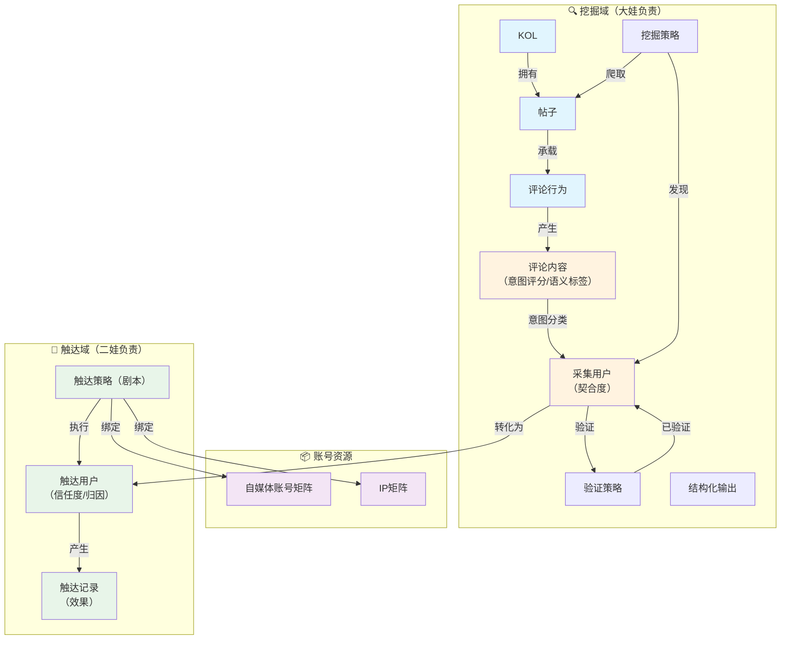

# 本体论：自媒体流量获客截留业务

**创建日期：2026-04-28**
**状态：v1.0**

---

## 一、本体论背景

本文档使用本体论视角，梳理"自媒体流量获客截留"业务的实体和关系。

**本体论的作用：**
- 为大娃Agent（情报Agent）提供"认知骨架"
- 让Agent理解业务概念之间的语义关联和因果关系
- 为后续算法层、数据层提供结构化基础

---

## 二、实体清单（14个）

### 核心业务对象（8个）

| # | 实体 | 定义 | 状态/属性 | 负责Agent |
|---|------|------|----------|----------|
| 1 | **KOL** | 流量源头 | — | 大娃 |
| 2 | **帖子** | 内容载体 | — | 大娃 |
| 3 | **评论行为** | 消费行为（谁、何时、对哪个帖子） | — | 大娃 |
| 4 | **评论内容** | 行为结果（具体说了什么） | 意图评分、意图状态、语义标签 | 大娃 |
| 5 | **采集用户** | 大娃负责的获客对象 | 状态：待清洗/待分配/已验证/待人工/已过滤<br>属性：契合度 | 大娃 |
| 6 | **触达用户** | 二娃负责的获客对象 | 状态：已分配/已触达/已转化/已关闭<br>属性：信任度、归因 | 二娃 |
| 7 | **流量** | 最终业务结果 | — | — |
| 8 | **验证策略** | 自动验证用户真实性（verify_users.py） | — | 大娃 |

### 账号资源（2个）

| # | 实体 | 定义 | 用途 |
|---|------|------|------|
| 9 | **自媒体账号矩阵** | 具体账号资源 | 触达时使用的账号 |
| 10 | **IP矩阵** | 网络IP资源 | 触达时绑定的IP |

### 挖掘策略域（2个）

| # | 实体 | 定义 | 包含 |
|---|------|------|------|
| 11 | **挖掘策略** | 发现目标的顶层策略 | 采集、清洗、加工（现阶段统一，后续可拆分） |
| 12 | **结构化输出** | 能力 + 结果 | 用户画像、数据产品 |

### 触达策略域（2个）

| # | 实体 | 定义 | 包含 |
|---|------|------|------|
| 13 | **触达策略（剧本）** | 触达用户的策略方式 | 账号绑定、IP绑定、话术、时机、行为方式、人设 |
| 14 | **触达记录** | 每次触达动作 | 效果属性（是否回复、是否转化、响应时间） |

---

## 三、实体演化说明

### 业务认知类实体的演进

| 实体 | MVP阶段 | 后续阶段 |
|------|---------|---------|
| **契合度** | 采集用户属性（≈意图评分） | 可能独立实体（需追踪分析） |
| **信任度** | 触达用户属性 | 可能独立实体（需追踪分析） |
| **归因** | 触达用户属性 | 独立实体（需追溯、分析、优化） |

### 触达策略的演进

| 阶段 | 触达策略定义 | 剧本定义 |
|------|-------------|---------|
| **MVP** | 剧本 = 触达策略（合一） | 话术+时机+行为方式+账号+IP+人设 |
| **后续** | 触达策略独立实体 | 剧本独立实体（可复用、可组合） |

---

## 四、关系清单

### 挖掘域关系

```
挖掘策略 --[爬取]--> 帖子
挖掘策略 --[发现]--> 采集用户（通过评论行为）

KOL --[拥有]--> 帖子（类型：发布/分享）
帖子 --[承载]--> 评论行为
用户 --[消费]--> 帖子（行为：评论行为）
评论行为 --[产生]--> 评论内容

评论内容 --[意图分类]--> 意图评分 + 意图状态
评论内容 --[语义识别]--> 语义标签（行为|情绪|语言）

意图评分 --[约等于]--> 契合度（采集用户属性）
```

### 状态流转关系

```
采集用户 --[状态流转]-->
  待清洗 → 待分配/待观察/已过滤（挖掘策略清洗）
  待分配 → 已验证/待人工/僵尸（验证策略验证）
  待人工 → 已验证/已过滤（人工确认）
  已验证 → [转化为触达用户]
```

### 实体转化关系

```
采集用户（已验证） --[转化为]--> 触达用户
       └── 采集用户状态锁定
       └── 新建触达用户实体
       └── 继承关键信息（用户ID、评论来源、意图评分等）
```

### 触达域关系

```
触达策略 --[绑定]--> 自媒体账号矩阵
触达策略 --[绑定]--> IP矩阵
触达策略 --[执行]--> 触达用户
       └── 产生触达记录

触达记录 --[反馈]--> 信任度（触达用户属性）
触达用户 --[转化时]--> 归因（属性：追溯触达策略+KOL+帖子+评论行为）
```

---

## 五、状态流转详细设计

### 采集用户状态流转

| 状态流转 | 负责方 | 方式 | 已有/待建 |
|---------|--------|------|----------|
| 待清洗 → 待分配/待观察/已过滤 | 大娃 deep_clean.py | 自动（关键词+评分） | ✅ 已有 |
| 待分配 → 已验证/待人工/僵尸 | 大娃 verify_users.py | 自动（浏览器访问主页） | ✅ 框架已有 |
| 待人工 → 已验证/已过滤 | 人工 | 飞书看备注判断 | 手动 |

### 触达用户状态流转

| 状态流转 | 负责方 | 方式 | 已有/待建 |
|---------|--------|------|----------|
| 已验证 → 已分配 | 触达策略 | 自动（按优先级分配给二娃） | ❌ 待建 |
| 已分配 → 已触达/已关闭 | 二娃执行 | 自动（发消息+记录结果） | ❌ 待建 |

---

## 六、分类系统设计

### 意图分类系统（商业价值判断）

**目的：** 判断用户值不值得触达，决定状态

**逻辑：**
```
评论内容
  ↓ 关键词匹配（4个词库）
  ├── HIGH_INTENT    ×3权重   "necesito prestamo", "whatsapp", "contactame"...
  ├── MEDIUM_INTENT  ×2权重   "informacion", "precio", "cuanto cuesta"...
  ├── COMPLAINT      ×2权重   "no sirve", "estafa", "dañada", "no responden"...
  └── LOW_INTENT     ×1权重   "problema", "error", "busco", "opinion"...
  ↓
  评分 = min(总加权 / 10, 1.0)
  ↓ 有联系方式 → 评分 +0.3
  ↓
  评分 < 0.2 → 已过滤
  high/medium 命中 → 待分配
  low 命中 → 待观察
  none → 已过滤
```

**关键设计：** 投诉类（COMPLAINT）算中意向，因为投诉用户有真实消费行为

### 语义识别系统（通用行为标签）

**目的：** 描述用户在做什么，给触达Agent提供上下文

**逻辑：**
```
评论内容
  ↓
  ┌─ 行为意图（7选1）
  │   求购/咨询/投诉/求助/推荐/分享/闲聊
  │
  ├─ 情绪强度（3级）
  │   强烈/中等/平淡
  │
  └─ 语言（自动检测）
      ES/PT/EN
  ↓
  组合输出: "投诉 | 强烈 | ES"
```

### 两套系统的关系

| 维度 | 意图分类 | 语义识别 |
|------|---------|---------|
| 决定什么 | 状态（待分配/已过滤） | 描述标签 |
| 绑定行业 | 是（借贷关键词） | 否（通用） |
| 输出字段 | 意图 + 评分 + 状态 | 语义 |
| 换行业要改 | 要改关键词库 | 不用改 |

---

## 七、验证策略分层处理

| 用户类型 | 验证方式 | 原因 |
|---------|---------|------|
| 评分 ≥ 0.7 + 有联系方式 | 自动通过 | 高置信度 |
| 评分 ≥ 0.4 + verify_users评分 ≥ 70 | 自动通过 | 主页活跃度验证真实性 |
| verify_users评分 40-69 | 人工确认 | 可疑，需看一眼 |
| verify_users评分 < 40 | 自动过滤 | 僵尸 |

---

## 八、知识图谱（Mermaid）



---

## 九、本体论的应用价值

### 对大娃Agent的价值

1. **认知骨架** — Agent知道"什么跟什么有关"
2. **语义理解** — 从信息点挖掘到信息面
3. **状态管理** — 清晰的实体边界和状态流转
4. **因果关系** — 评论→意图→契合度→验证→触达→转化

### 对后续演进的价值

1. **算法层基础** — 实体清晰后，预测算法才有"输入对象"
2. **数据层基础** — 关系清晰后，数据流转才有"管道设计"
3. **Agent协作协议** — 采集用户/触达用户边界清晰，避免多Agent操作混乱

---

## 十、后续演进方向

### MVP阶段（当前）

- 14个实体
- 关系清晰
- 状态流转明确
- 分类系统可用（关键词规则）

### 后续阶段

- 归因独立实体
- 剧本独立实体
- 挖掘策略拆分（采集/清洗/加工独立）
- ML模型替代关键词规则（1000+样本后）
- 触达闭环数据 → 分类系统优化

---

**文档版本：v1.0**
**最后更新：2026-04-28**