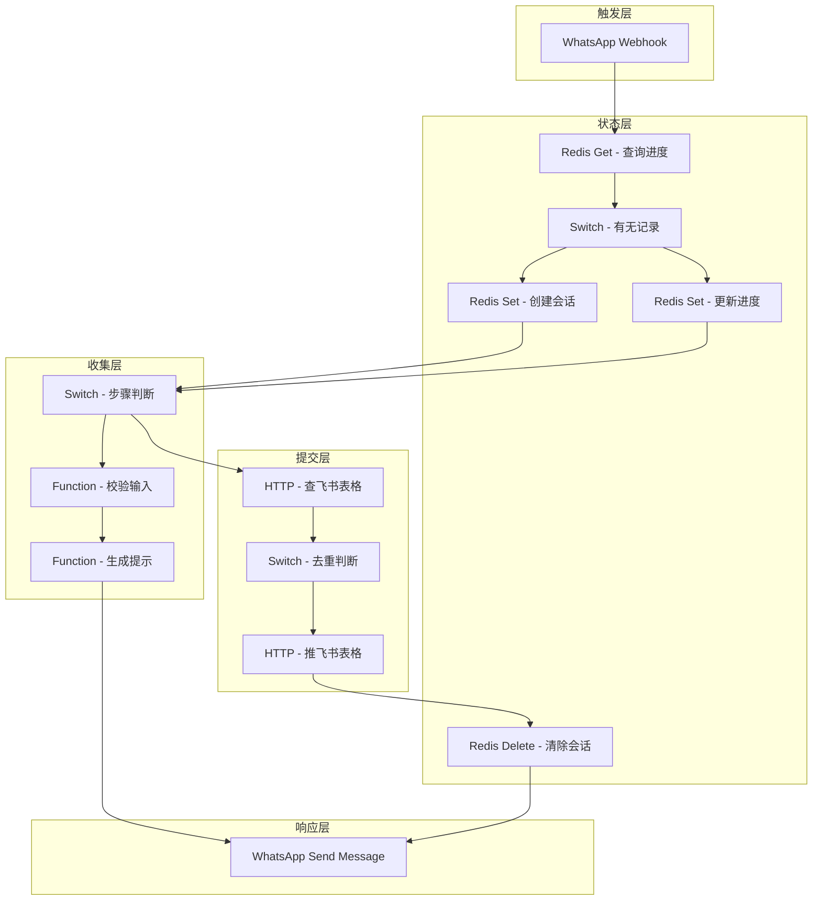
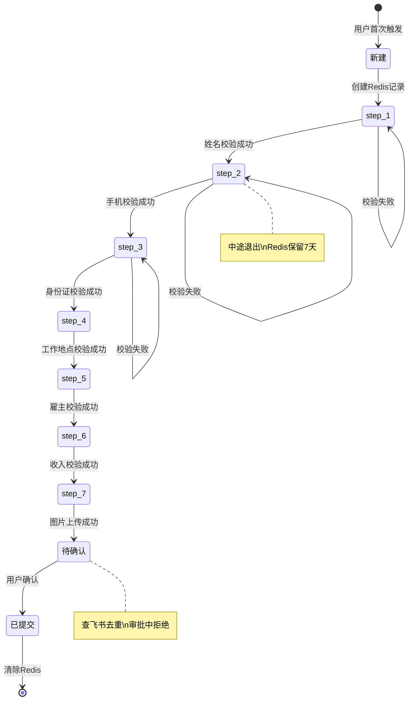

# WhatsApp 进件 Agent PRD

> **版本：** v1.2  
> **作者：** 小宁（RAKkDm）  
> **日期：** 2026-04-25  
> **状态：** 草稿  
> **优先级：** P0  
> **类型：** 业务流程自动化（N8N 工作流）  
> **更新记录：**  
> - v1.1 补充完整获客链路、Agent间身份传递、意图分流架构  
> - v1.2 补充28步收集设计、校验规则、飞书表格完整字段映射

---

## 1. 需求背景

### 1.1 业务背景

#### 1.1.1 完整获客链路

OFW（海外劳工）信贷业务的完整获客链路：

```
采集/挖掘 Agent → 触达 Agent → 售前 Agent → 进件 Agent → 审批流程
      ↓                ↓              ↓              ↓
   发现目标         打窝           引导咬钩        钓鱼
```

**各环节定位：**

| 环节 | Agent | 角色 | 状态 | 动作 |
|:-----|:------|:-----|:-----|:-----|
| **采集/挖掘** | 情报 Agent | 找鱼群 | 发现目标 | 爬取、清洗、筛选目标用户 |
| **触达** | 执行 Agent | 打窝 | 还没咬钩 | 抛链接、吸引注意、激发好奇 |
| **售前** | 售前 Agent | 引导咬钩 | 快咬钩了 | 知识库问答、产品介绍、推动"我要借款"意图 |
| **进件** | 进件 Agent | 钓鱼 | 已咬钩 | 收集信息、博弈中、推进审批 |

#### 1.1.2 进件 Agent 的定位

**进件 Agent 是"钓鱼环节"——用户已经咬钩，开始博弈。**

| 定位 | 说明 |
|:-----|:-----|
| **承接售前/触达 Agent** | 用户被激发"我要借款"意图后，主动触发进件流程 |
| **MVP 入口之一** | WhatsApp 只是第一个入口，后续可扩展 Messenger、Web 表单等 |
| **多入口统一工作流** | 不同入口公用同一个进件 Agent，统一处理逻辑 |
| **飞书表格临时方案** | MVP 验证闭环用飞书表格，后续演进方案待定 |

#### 1.1.3 用户身份在 Agent 间的传递

**触达 Agent 如何交接给进件 Agent：**

```
触达 Agent 抛链接 → 用户点击 → 跳到 WhatsApp/其他 IM
                                        ↓
                              用户联系方式作为唯一标识
                                        ↓
                              进件 Agent 查询历史信息
                                        ↓
                              获取触达记录、售前对话历史
```

| 关键点 | 说明 |
|:-------|:-----|
| **唯一标识** | 用户联系方式（手机号） |
| **历史信息查询** | 通过唯一标识查 Redis/飞书，获取是否被触达过、是否有售前对话 |

#### 1.1.4 前台公用窗口，后台意图分流

**用户发消息到同一个 WhatsApp 窗口，后台意图识别分流：**

```
用户发消息（WhatsApp 公用窗口）
          ↓
    意图识别 Agent（分流）
          ↓
┌─────────┼─────────┐
↓         ↓         ↓
售前Agent  进件Agent  其他
（引导咬钩） （钓鱼）
↓         ↓
激发意图  收集信息
↓         ↓
引导"我要借款" → 进件Agent
```

| 意图 | 分流目标 | 处理 |
|:-----|:---------|:-----|
| "我要借款" / "申请贷款" | 进件 Agent | 开始进件流程 |
| "产品介绍" / "利率多少" | 售前 Agent | 知识库问答 |
| "活动优惠" / "有什么福利" | 售前 Agent | 活动介绍 |
| 其他 | 默认处理 | FAQ 或人工 |

#### 1.1.5 WhatsApp 的选择

**WhatsApp 是菲律宾 OFW 最常用的通讯工具，渗透率 >95%。**

MVP 选择 WhatsApp 作为入口的原因：
- 用户熟悉，无需额外下载
- 对话形式天然适合引导式进件
- Meta Cloud API 合规可用

**后续可扩展入口：**
- Messenger（FB 用户群体）
- Web 表单（官网落地页）
- App 内嵌（如有自有 App）

### 1.2 技术选型

| 技术栈 | 选型 | 原因 | 备注 |
|:-------|:-----|:-----|:-----|
| **工作流引擎** | N8N 云版 | 可视化编排，无需自托管 | MVP 快速验证 |
| **对话状态存储** | Upstash Redis | Serverless Redis，N8N 原生支持 | 免费 10k请求/天 |
| **进件数据存储** | 飞书多维表格 | 用户已有，无需新增系统 | **MVP 临时方案，后续待定** |
| **消息入口** | WhatsApp Cloud API | Meta 官方 API，合规 | 后续可扩展 Messenger/Web |

**待定事项：飞书表格后续演进方案（正式数据库 / 业务系统 API / Copaw 内部存储）**

### 1.3 用户痛点

| 用户角色 | 痛点 | 影响 |
|:---------|:-----|:-----|
| **OFW 用户** | 进件流程复杂，不知道填什么 | 放弃申请，流失 |
| **OFW 用户** | 中途退出后不知道如何继续 | 需要重新开始，体验差 |
| **运营人员** | 人工接待进件效率低 | 无法规模化 |
| **审批人员** | 收到的进件信息不完整 | 需要反复沟通补件 |

### 1.4 预期收益

| 收益维度 | 预期效果 | 衡量指标 |
|:---------|:---------|:---------|
| **用户体验** | 引导式填表，中途可恢复 | 进件完成率提升 20%+ |
| **效率提升** | 自动化 7×24 接待 | 人力成本降低 80% |
| **数据质量** | 必填字段强制校验 | 进件信息完整率 >95% |
| **防重复提交** | 手机号去重，审批中拒绝重复 | 重复进件率 <1% |

---

## 2. 需求描述

### 2.1 功能概述

WhatsApp 进件 Agent 是基于 N8N 的自动化对话流程，核心功能：

- **引导式对话** — 用户发消息触发，一步步引导填写进件信息
- **状态管理** — Redis 存对话进度，中途退出可继续上次
- **数据校验** — 每步校验输入格式，错误提示并引导重填
- **去重逻辑** — 手机号查重，审批中拒绝重复提交
- **飞书同步** — 用户确认后，推送飞书表格，进入审批队列

### 2.2 用户故事

| 编号 | 角色 | 行为 | 收益 | 优先级 |
|:-----|:-----|:-----|:-----|:------:|
| US-01 | OFW 用户 | 发消息"我要借款"触发进件流程 | 快速进入申请流程 | P0 |
| US-02 | OFW 用户 | 一步步填写姓名、手机、身份证等信息 | 不会迷失，知道填什么 | P0 |
| US-03 | OFW 用户 | 中途退出后重新发消息 | 继续上次进度，不用重新填 | P0 |
| US-04 | OFW 用户 | 输入格式错误（如手机号格式不对） | 收到错误提示，知道怎么改 | P0 |
| US-05 | OFW 用户 | 填完所有信息后确认提交 | 进件成功，等待审批结果 | P0 |
| US-06 | OFW 用户 | 审批中再次申请 | 收到提示"申请正在审核" | P0 |
| US-07 | 审批人员 | 查看飞书表格中的新进件 | 信息完整，可直接审批 | P0 |

### 2.3 功能详情

| 功能模块 | 功能点 | 描述 | 优先级 |
|:---------|:-------|:-----|:------:|
| **对话触发** | WhatsApp Webhook 接收 | 用户发消息触发工作流 | P0 |
| **状态查询** | Redis 查询用户进度 | 检查是否有进行中的对话 | P0 |
| **状态恢复** | 继续上次进度 | 有记录 → 提示当前步骤，继续填 | P0 |
| **新建对话** | 创建新会话 | 无记录 → 创建 Redis 记录，开始第一步 | P0 |
| **信息收集** | 逐步收集字段 | 每步收集一个字段，校验后存入 Redis | P0 |
| **格式校验** | 输入校验 | 手机号、身份证等格式校验 | P0 |
| **去重检查** | 手机号查重 | 提交前查飞书表格，检查是否审批中 | P0 |
| **确认提交** | 用户确认 | 用户点确认 → 推送飞书，清除 Redis | P0 |
| **飞书同步** | 推送飞书表格 | 新增进件记录，状态：待审批 | P0 |

---

## 3. 业务流程

### 3.1 进件完整流程

```
┌─────────────────────────────────────────────────────────────────┐
│                     用户首次发消息                               │
│                                                                 │
│  用户："我要借款"                                                │
│                                                                 │
└─────────────────────────────────────────────────────────────────┘
                          ↓ Webhook 触发
┌─────────────────────────────────────────────────────────────────┐
│                     N8N 工作流启动                               │
│                                                                 │
│  ① 查 Redis：wa:{用户WhatsApp号} 有无记录？                      │
│                                                                 │
└─────────────────────────────────────────────────────────────────┘
                          ↓
              ┌───────────┴───────────┐
              ↓                       ↓
          有记录                   无记录
              ↓                       ↓
      ┌─────────────┐          ┌─────────────┐
      │ 恢复进度     │          │ 新建会话     │
      │ 提示当前步骤 │          │ 创建 Redis   │
      └─────────────┘          │ 开始 step_1  │
                               └─────────────┘
                          ↓
┌─────────────────────────────────────────────────────────────────┐
│                     逐步收集信息                                 │
│                                                                 │
│  step_1: 姓名 → step_2: 手机 → step_3: 身份证 → ... → step_N   │
│                                                                 │
│  每步：                                                         │
│  ├── 校验输入格式                                               │
│  ├── 存入 Redis data                                            │
│  ├── 更新 step                                                  │
│  └── 返回下一步提示                                             │
│                                                                 │
└─────────────────────────────────────────────────────────────────┘
                          ↓ 全部必填完成
┌─────────────────────────────────────────────────────────────────┐
│                     去重检查                                     │
│                                                                 │
│  ② 查飞书表格：该手机号有无"审批中"记录？                        │
│                                                                 │
└─────────────────────────────────────────────────────────────────┘
                          ↓
              ┌───────────┴───────────┐
              ↓                       ↓
          有（审批中）              无
              ↓                       ↓
      ┌─────────────┐          ┌─────────────┐
      │ 拒绝提交     │          │ 确认提示     │
      │ 返回提示     │          │ "请确认提交" │
      └─────────────┘          └─────────────┘
                                      ↓ 用户确认
┌─────────────────────────────────────────────────────────────────┐
│                     提交进件                                     │
│                                                                 │
│  ③ 推送飞书表格                                                 │
│     ├── 新增记录                                                 │
│     ├── 状态：待审批                                             │
│     └── 提交时间：当前时间                                       │
│                                                                 │
│  ④ 清除 Redis                                                   │
│     删除 wa:{用户WhatsApp号}                                     │
│                                                                 │
│  ⑤ 返回成功提示                                                 │
│     "您的申请已提交，正在审核中"                                 │
│                                                                 │
└─────────────────────────────────────────────────────────────────┘
```

### 3.2 对话状态流转

```
新建 → step_1 → step_2 → ... → step_N → 待确认 → 已提交
  ↑                                              ↓
  │                                              │
  用户首次触发                              清除 Redis
  │                                              │
  └──────────────────────────────────────────────┘
                    （用户可重新开始新进件）
```

### 3.3 中途退出恢复流程

```
用户中途退出（如关闭 WhatsApp）
    ↓
Redis 记录保留（TTL 7天）
    ↓
用户重新发消息
    ↓
查 Redis：有记录 → 恢复进度
    ↓
返回提示："您上次填到了 step_3（身份证），请继续填写"
    ↓
用户继续填写
```

### 3.4 去重逻辑

| 场景 | 飞书查询条件 | 处理方式 | 用户提示 |
|:-----|:-------------|:---------|:---------|
| **审批中重复提交** | 手机号 + 状态=审批中 | 拒绝提交 | "您的申请正在审核中，请耐心等待" |
| **已通过再申请** | 手机号 + 状态=已通过 | 可配置冷却期 | "您上次申请已通过，X天后可再申请" |
| **被拒后再申请** | 手机号 + 状态=已拒绝 | 可配置冷却期 | "您的申请被拒绝，X天后可再申请" |

**MVP 阶段：审批中拒绝，其他场景提示但不强制。**

---

## 4. 功能规格（用户端）

### 4.1 收集步骤设计总览

**MVP 版本共 28 步：**

| Phase | 步骤范围 | 内容 | 说明 |
|:------|:---------|:-----|:-----|
| **Phase A** | step_1-26 | WhatsApp 结构化信息收集 | 逐步引导，无进度提示 |
| **Phase B** | step_27 | 发送 H5 URL | 证件上传 + OCR + 活体检测 + 设备采集 |
| **Phase C** | step_28 | 确认提交 | 推送飞书表格 |

### 4.2 WhatsApp 对话界面（Phase A：结构化信息收集）

#### 4.2.1 基本信息（step_1-7）

| 步骤 | 系统提示 | 用户输入 | 字段名 | 校验规则 |
|:-----|:---------|:---------|:-------|:---------|
| **触发** | 用户发"我要借款"等关键词 | — | — | 关键词匹配 |
| **step_1** | "请确认您的手机号码：{自动获取的号码}，回复'确认'继续或输入新号码" | 手机号 | `phone` | 手机号格式（+52开头） |
| **step_2** | "请告诉我您的姓名（完整姓名）" | 姓名 | `full_name` | 非空，2-100字符 |
| **step_3** | "请告诉我您的生日（格式：YYYY-MM-DD，如1990-05-15）" | 生日 | `birthday` | 日期格式，年龄18-65 |
| **step_4** | "请选择您的性别：回复'男'或'女'" | 性别 | `gender` | M/F |
| **step_5** | "请选择您的婚姻状况：单身/已婚/离异/丧偶" | 婚姻状况 | `marital_status` | single/married/divorced/widowed |
| **step_6** | "请选择您的教育程度：小学/中学/高中/大学/研究生" | 教育程度 | `education` | primary/secondary/high_school/university/postgraduate |
| **step_7** | "请告诉我您有多少个子女（回复数字，如0、1、2）" | 子女数量 | `children_number` | 数字，0-10 |

#### 4.2.2 联系方式（step_8-9）

| 步骤 | 系统提示 | 用户输入 | 字段名 | 校验规则 |
|:-----|:---------|:---------|:-------|:---------|
| **step_8** | "请告诉我您的邮箱地址" | 邮箱 | `email` | 邮箱格式 |
| **step_9** | "请告诉我您的备用手机号码（如无，回复'无'）" | 备用手机 | `spare_phone` | 手机号格式或"无" |

#### 4.2.3 居住地址（step_10-12）

| 步骤 | 系统提示 | 用户输入 | 字段名 | 校验规则 |
|:-----|:---------|:---------|:-------|:---------|
| **step_10** | "请告诉我您的完整居住地址（街道、城市、州、邮编）" | 完整地址 | `full_address` | 非空，10-200字符 |
| **step_11** | "请选择您的居住类型：租房/自有/与家人同住/其他" | 居住类型 | `living_type` | rent/own/family/other |
| **step_12** | "请告诉我您在此地址居住多久了（年数，如3）" | 居住时长 | `living_years` | 数字，0-50 |

#### 4.2.4 工作信息（step_13-18）

| 步骤 | 系统提示 | 用户输入 | 字段名 | 校验规则 |
|:-----|:---------|:---------|:-------|:---------|
| **step_13** | "请告诉我您的雇主名称（公司名称）" | 雇主名称 | `employer_name` | 非空，2-100字符 |
| **step_14** | "请告诉我您的职位" | 职位 | `position` | 非空，2-50字符 |
| **step_15** | "请告诉我您在这家公司工作多久了（月数，如12）" | 工作时长 | `work_months` | 数字，0-600 |
| **step_16** | "请告诉我您的月收入（墨西哥比索，如15000）" | 月收入 | `monthly_income` | 数字，>0 |
| **step_17** | "请选择您的发薪方式：周薪/月薪/双周薪/其他" | 发薪方式 | `salary_type` | weekly/monthly/biweekly/other |
| **step_18** | "请告诉我您的发薪日（如每月15日，回复15）" | 发薪日 | `salary_day` | 数字，1-31 |

#### 4.2.5 银行信息（step_19-21）

| 步骤 | 系统提示 | 用户输入 | 字段名 | 校验规则 |
|:-----|:---------|:---------|:-------|:---------|
| **step_19** | "请告诉我您的银行名称" | 银行名称 | `bank_name` | 非空，银行列表校验 |
| **step_20** | "请选择您的账户类型：储蓄账户/工资账户" | 账户类型 | `account_type` | savings/payroll |
| **step_21** | "请告诉我您的银行账号（18位）" | 银行账号 | `bank_account` | 18位数字 |

#### 4.2.6 紧急联系人（step_22-24）

| 步骤 | 系统提示 | 用户输入 | 字段名 | 校验规则 |
|:-----|:---------|:---------|:-------|:---------|
| **step_22** | "请告诉我紧急联系人的姓名" | 联系人姓名 | `emergency_contact_name` | 非空，2-50字符 |
| **step_23** | "请告诉我您与紧急联系人的关系（如父母、配偶、朋友）" | 关系 | `emergency_contact_relation` | 非空 |
| **step_24** | "请告诉我紧急联系人的电话号码" | 联系人电话 | `emergency_contact_phone` | 手机号格式 |

#### 4.2.7 产品选择（step_25-26）

| 步骤 | 系统提示 | 用户输入 | 字段名 | 校验规则 |
|:-----|:---------|:---------|:-------|:---------|
| **step_25** | "请告诉我您想申请的贷款金额（墨西哥比索，如5000）" | 贷款金额 | `loan_amount` | 数字，范围校验 |
| **step_26** | "请选择贷款期限：7天/14天/30天/60天/90天" | 贷款期限 | `loan_term` | 7/14/30/60/90 |

### 4.3 H5 非结构化信息收集（Phase B：step_27）

**step_26 完成后，发送 H5 URL：**

| 内容 | 说明 |
|:-----|:-----|
| **系统提示** | "请点击以下链接完成证件上传和人脸验证：{URL}" |
| **URL 参数** | `https://xxx.com/verify?session={wa_number}` |

**H5 页面功能：**

| 功能模块 | 字段 | 说明 |
|:---------|:-----|:-----|
| **证件正面上传** | `id_front_photo` | JPG/PNG，大小限制 5MB |
| **证件反面上传** | `id_back_photo` | JPG/PNG，大小限制 5MB |
| **OCR 服务** | `ocr_result` | 自动提取证件信息（存档，不回填 WhatsApp） |
| **活体检测** | `face_video` | 眨眼/摇头/点头，3-5秒视频 |
| **人证对比** | `face_match_result` | 人脸与证件照片比对，返回匹配度 |
| **设备采集** | `device_id`, `register_ip`, `gps_location` | 自动采集设备信息 |

**H5 完成后处理：**

| 方案 | 说明 |
|:-----|:-----|
| **Webhook 回调** | H5 完成后调用 N8N Webhook，自动推进到 step_28 |
| **用户确认** | WhatsApp 发送"证件验证已完成"，用户回复继续 |

### 4.4 确认提交（Phase C：step_28）

| 步骤 | 系统提示 | 用户输入 | 校验规则 |
|:-----|:---------|:---------|:---------|
| **step_28** | "您的申请信息已完成，回复'确认'提交申请" | "确认" | 精确匹配 |

**提交后处理：**

| 处理 | 说明 |
|:-----|:-----|
| **推送飞书表格** | 完整 JSON 数据，状态：待审批 |
| **清除 Redis** | 删除会话状态 |
| **成功提示** | "您的申请已提交，正在审核中。审核结果将通过此 WhatsApp 通知您。" |

### 4.5 错误提示

| 错误类型 | 提示内容 |
|:---------|:---------|
| **格式错误** | "您输入的格式不正确，请重新输入" |
| **手机号已存在** | "您的申请正在审核中，请耐心等待" |
| **数值超范围** | "您输入的数值不在有效范围内，请重新输入" |
| **选择项错误** | "请回复正确的选项：{选项列表}" |

### 4.6 成功提示

| 场景 | 提示内容 |
|:-----|:---------|
| **提交成功** | "您的申请已提交，正在审核中。审核结果将通过此 WhatsApp 通知您。" |
| **恢复进度** | "您上次填到了第 X 步，请继续填写。" |
| **H5 完成** | "证件验证已完成，请回复'确认'提交申请" |

---

## 5. 功能规格（后台/技术端）

### 5.1 N8N 工作流节点设计

| 节点序号 | 节点类型 | 节点名称 | 功能 |
|:---------|:---------|:---------|:-----|
| 1 | Trigger | WhatsApp Webhook | 接收用户消息 |
| 2 | Redis | Redis Get | 查询用户进度 |
| 3 | Switch | 判断状态 | 有记录/无记录分支 |
| 4 | Redis | Redis Set | 创建新会话 |
| 5 | Function | 恢复进度 | 解析 Redis 数据，返回当前步骤 |
| 6 | Switch | 步骤判断 | step_1 ~ step_N 分支 |
| 7 | Function | 校验输入 | 格式校验逻辑 |
| 8 | Redis | Redis Set | 更新进度 + 存数据 |
| 9 | Function | 生成提示 | 返回下一步提示文本 |
| 10 | WhatsApp | Send Message | 发送提示给用户 |
| 11 | HTTP | 查飞书表格 | 手机号去重查询 |
| 12 | Switch | 去重判断 | 有记录/无记录分支 |
| 13 | HTTP | 推送飞书表格 | 新增进件记录 |
| 14 | Redis | Redis Delete | 清除会话状态 |
| 15 | WhatsApp | Send Message | 发送成功提示 |

### 5.2 Redis 数据结构

```json
{
  "key": "wa:639123456789",
  "value": {
    "step": "step_3_身份证",
    "data": {
      "姓名": "张三",
      "手机号": "639123456789",
      "工作地点": "新加坡"
    },
    "created_at": "2026-04-25T06:00:00Z",
    "updated_at": "2026-04-25T06:05:00Z"
  },
  "ttl": 604800  // 7天
}
```

### 5.3 飞书表格字段映射

**MVP 版本完整字段清单（基于 application-template.json）：**

#### 5.3.1 线索来源（获客Agent产出）

| 飞书字段名 | JSON 字段路径 | 类型 | 来源 |
|:-----------|:--------------|:-----|:-----|
| `线索ID` | `lead_id` | 数字 | 自动生成 |
| `来源渠道` | `source_channel` | 文本 | WhatsApp |
| `来源活动` | `source_campaign` | 文本 | 活动 ID |

#### 5.3.2 用户注册

| 飞书字段名 | JSON 字段路径 | 类型 | 必填 | 来源 |
|:-----------|:--------------|:-----|:----:|:-----|
| `手机号` | `phone` | 文本 | ★ | WhatsApp 自动获取 |
| `国家` | `country` | 文本 | ★ | 自动填充 MX |
| `应用名称` | `app_name` | 文本 | ★ | 自动填充 |
| `设备ID` | `device_id` | 文本 | ★ | H5 采集 |
| `注册IP` | `register_ip` | 文本 | ★ | H5 采集 |

#### 5.3.3 身份信息

| 飞书字段名 | JSON 字段路径 | 类型 | 必填 | 来源 |
|:-----------|:--------------|:-----|:----:|:-----|
| `完整姓名` | `full_name` | 文本 | ★ | step_2 |
| `名` | `first_name` | 文本 | — | 可拆分 |
| `姓` | `last_name` | 文本 | — | 可拆分 |
| `父姓` | `father_last_name` | 文本 | — | 墨西哥特有 |
| `母姓` | `mother_last_name` | 文本 | — | 墨西哥特有 |
| `证件类型` | `id_type` | 文本 | ★ | INE |
| `证件号码` | `id_number` | 文本 | ★ | OCR 提取 |
| `生日` | `birthday` | 日期 | ★ | step_3 |
| `性别` | `gender` | 文本 | ★ | step_4 |
| `婚姻状况` | `marital_status` | 文本 | ★ | step_5 |
| `教育程度` | `education` | 文本 | ★ | step_6 |
| `子女数量` | `children_number` | 数字 | ★ | step_7 |

#### 5.3.4 联系方式

| 飞书字段名 | JSON 字段路径 | 类型 | 必填 | 来源 |
|:-----------|:--------------|:-----|:----:|:-----|
| `手机号` | `phone` | 文本 | ★ | step_1 |
| `邮箱` | `email` | 文本 | ★ | step_8 |
| `WhatsApp` | `whatsapp` | 文本 | ★ | WhatsApp 自动获取 |
| `备用手机` | `spare_phone` | 文本 | ☆ | step_9 |

#### 5.3.5 居住地址

| 飞书字段名 | JSON 字段路径 | 类型 | 必填 | 来源 |
|:-----------|:--------------|:-----|:----:|:-----|
| `完整地址` | `full_address` | 文本 | ★ | step_10 |
| `居住类型` | `living_type` | 文本 | ★ | step_11 |
| `居住时长` | `living_years` | 数字 | ★ | step_12 |

#### 5.3.6 工作信息

| 飞书字段名 | JSON 字段路径 | 类型 | 必填 | 来源 |
|:-----------|:--------------|:-----|:----:|:-----|
| `雇主名称` | `employer_name` | 文本 | ★ | step_13 |
| `职位` | `position` | 文本 | ★ | step_14 |
| `工作时长` | `work_months` | 数字 | ★ | step_15 |
| `月收入` | `monthly_income` | 数字 | ★ | step_16 |
| `发薪方式` | `salary_type` | 文本 | ★ | step_17 |
| `发薪日` | `salary_day` | 数字 | ★ | step_18 |

#### 5.3.7 银行信息

| 飞书字段名 | JSON 字段路径 | 类型 | 必填 | 来源 |
|:-----------|:--------------|:-----|:----:|:-----|
| `银行名称` | `bank_name` | 文本 | ★ | step_19 |
| `账户类型` | `account_type` | 文本 | ★ | step_20 |
| `银行账号` | `bank_account` | 文本 | ★ | step_21 |

#### 5.3.8 紧急联系人

| 飞书字段名 | JSON 字段路径 | 类型 | 必填 | 来源 |
|:-----------|:--------------|:-----|:----:|:-----|
| `紧急联系人姓名` | `emergency_contacts[0].name` | 文本 | ★ | step_22 |
| `紧急联系人关系` | `emergency_contacts[0].relation` | 文本 | ★ | step_23 |
| `紧急联系人电话` | `emergency_contacts[0].phone` | 文本 | ★ | step_24 |

#### 5.3.9 产品选择

| 飞书字段名 | JSON 字段路径 | 类型 | 必填 | 来源 |
|:-----------|:--------------|:-----|:----:|:-----|
| `贷款金额` | `loan_amount` | 数字 | ★ | step_25 |
| `贷款期限` | `loan_term` | 数字 | ★ | step_26 |

#### 5.3.10 证件照片与验证结果

| 飞书字段名 | JSON 字段路径 | 类型 | 必填 | 来源 |
|:-----------|:--------------|:-----|:----:|:-----|
| `证件正面照片` | `id_front_photo` | 图片链接 | ★ | H5 上传 |
| `证件反面照片` | `id_back_photo` | 图片链接 | ★ | H5 上传 |
| `OCR结果` | `ocr_result` | JSON | ★ | OCR 服务 |
| `活体检测视频` | `face_video` | 视频链接 | ★ | H5 上传 |
| `人证对比结果` | `face_match_result` | JSON | ★ | 人证对比服务 |

#### 5.3.11 系统字段

| 飞书字段名 | JSON 字段路径 | 类型 | 必填 | 来源 |
|:-----------|:--------------|:-----|:----:|:-----|
| `申请ID` | `application_id` | 文本 | — | 自动生成 UUID |
| `提交时间` | `submit_time` | 日期时间 | — | 自动生成 |
| `状态` | `status` | 文本 | — | 待审批 |
| `GPS位置` | `gps_location` | 文本 | — | H5 采集 |

**飞书表格总计：~35 个字段**

### 5.4 WhatsApp Cloud API 配置

| 配置项 | 说明 |
|:-------|:-----|
| **Webhook URL** | N8N 云版提供的 Webhook 地址 |
| **验证令牌** | Meta Business API 配置 |
| **消息模板** | Meta 审核通过的模板消息 |
| **24h 窗口限制** | 用户发消息后 24h 内可自由回复 |

---

## 6. 数据埋点

| 事件名称 | 触发时机 | 参数 | 说明 |
|:---------|:---------|:-----|:-----|
| `wa_session_start` | 用户首次触发 | wa_number | 新会话创建 |
| `wa_session_resume` | 用户恢复进度 | wa_number, step | 中途退出恢复 |
| `wa_step_complete` | 每步完成 | wa_number, step, field | 字段收集 |
| `wa_step_error` | 输入校验失败 | wa_number, step, error_type | 校验失败 |
| `wa_submit_success` | 提交成功 | wa_number, phone | 进件完成 |
| `wa_submit_blocked` | 去重拦截 | wa_number, reason | 审批中重复 |

---

## 7. 验收标准

| 编号 | 验收项 | 验收标准 | 优先级 |
|:-----|:-------|:---------|:------:|
| AC-01 | WhatsApp Webhook 触发 | 用户发消息，工作流正常启动 | P0 |
| AC-02 | Redis 状态查询 | 正确查询用户进度，有/无记录分支正确 | P0 |
| AC-03 | 新建会话 | 无记录 → 创建 Redis，返回 step_1 提示 | P0 |
| AC-04 | 恢复进度 | 有记录 → 返回当前步骤提示 | P0 |
| AC-05 | 字段收集 | 每步正确收集、校验、存储 | P0 |
| AC-06 | 格式校验 | 错误输入返回正确提示 | P0 |
| AC-07 | 去重检查 | 手机号审批中 → 拒绝提交 | P0 |
| AC-08 | 飞书推送 | 确认后正确推送飞书表格 | P0 |
| AC-09 | Redis 清除 | 提交后清除会话状态 | P0 |
| AC-10 | TTL 过期 | 7天后自动清除未完成会话 | P1 |
| AC-11 | 进件完整率 | 信息完整率 >95% | P1 |

---

## 8. 附录

### 8.1 待确认事项

| 待确认项 | 确认方 | 状态 | 影响 |
|:---------|:-------|:----:|:-----|
| **进件字段 JSON 结构** | 用户 | ✅ 已确认 | v1.2 已补充完整字段映射 |
| **WhatsApp Business API 账号** | 用户 | ⏳ 待确认 | 是否已有，是否需要协助申请 |
| **飞书表格 API 权限** | 用户 | ⏳ 待确认 | 是否有 API Token，表格 ID |
| **飞书表格后续演进方案** | 待定 | ⏳ 待确认 | 正式数据库 / 业务系统 API / Copaw 内部存储 |
| **审批通知方式** | 用户 | ⏳ 待确认 | 后续阶段，飞书机器人/钉钉/邮件 |
| **冷却期配置** | 用户 | ⏳ 待确认 | 已通过/被拒后多久可再申请 |

### 8.2 后续迭代

| 功能 | 阶段 | 说明 |
|:-----|:-----|:-----|
| **意图识别 Agent** | Phase 1 | 用户消息意图分类，分流到售前/进件 |
| **售前 Agent** | Phase 1 | 知识库问答、产品介绍、激发"我要借款"意图 |
| **审批通知** | Phase 2 | 审批结果通过 WhatsApp 推送给用户 |
| **补件流程** | Phase 2 | 审批要求补件，Agent 引导补充 |
| **多入口支持** | Phase 2 | Messenger、Web 表单统一接入 |
| **对话分支** | Phase 2 | 无工作证明走替代路径 |
| **风控预审集成** | Phase 3 | 集成风控 Agent，实时预审 |
| **数据存储演进** | Phase 3 | 飞书表格迁移到正式存储方案 |

### 8.3 后续迭代



---

## B. 状态机设计



---

## C. 成本评估

| 成本项 | 计算方式 | 预估成本 |
|:-------|:---------|:---------|
| **N8N 云版** | Starter Plan | $20/月 |
| **Upstash Redis** | 免费额度 10k请求/天 | $0（初期） |
| **WhatsApp Cloud API** | 前 1000 条对话/月免费 | $0（初期） |
| **飞书表格** | 免费 | $0 |

**初期月成本：<$30**

---

**文档版本：** v1.2  
**最后更新：** 2026-04-25