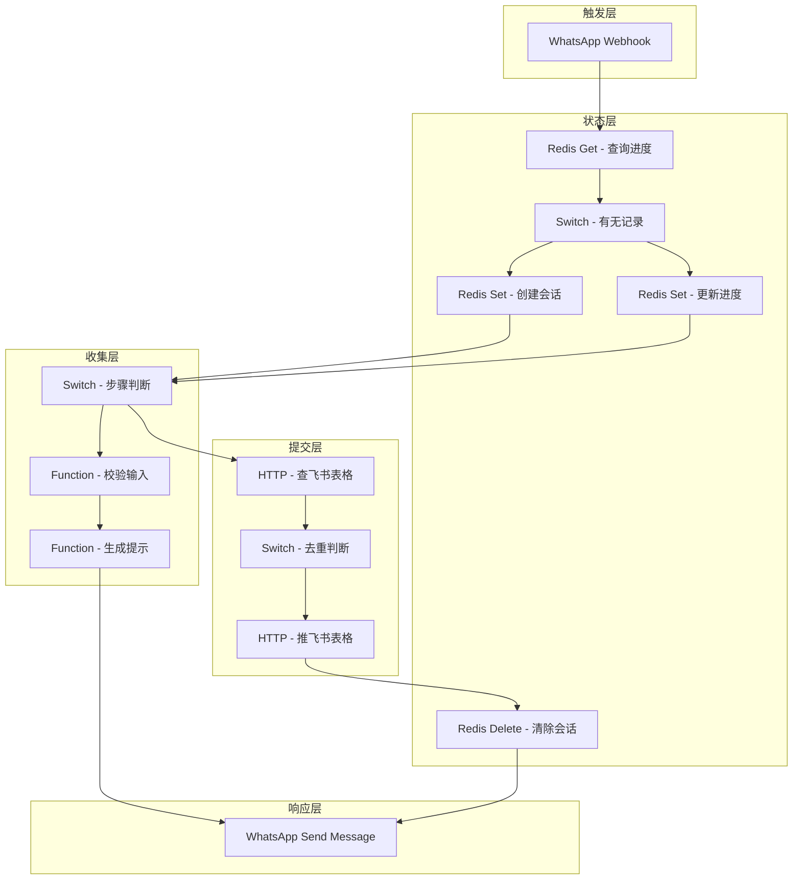
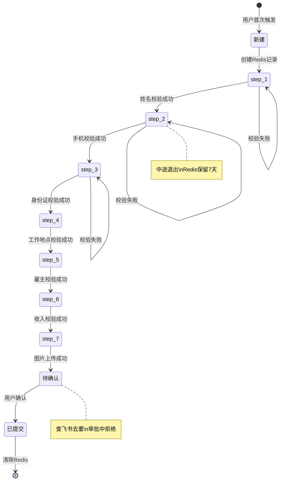

# WhatsApp 进件 Agent PRD

> **版本：** v1.0  
> **作者：** 小宁（RAKkDm）  
> **日期：** 2026-04-25  
> **状态：** 草稿  
> **优先级：** P0  
> **类型：** 业务流程自动化（N8N 工作流）

---

## 1. 需求背景

### 1.1 业务背景

OFW（海外劳工）信贷业务需要高效的用户进件流程。传统进件方式：

| 方式 | 问题 |
|:-----|:-----|
| 线下填表 | 人力成本高，效率低 |
| Web 表单 | 用户流失率高，缺乏引导 |
| 人工对话 | 7×24 人力成本不可承受 |

**WhatsApp 是菲律宾 OFW 最常用的通讯工具，渗透率 >95%。**

通过 WhatsApp 引导式对话进件，可以：
- 降低用户流失（在熟悉场景完成）
- 提升填表体验（一步步引导，不迷失）
- 降低人力成本（自动化 7×24）

### 1.2 技术选型

| 技术栈 | 选型 | 原因 |
|:-------|:-----|:-----|
| **工作流引擎** | N8N 云版 | 可视化编排，无需自托管 |
| **对话状态存储** | Upstash Redis | Serverless Redis，N8N 原生支持，免费额度够用 |
| **进件数据存储** | 飞书多维表格 | 用户已有，无需新增系统 |
| **消息入口** | WhatsApp Cloud API | Meta 官方 API，合规 |

### 1.3 用户痛点

| 用户角色 | 痛点 | 影响 |
|:---------|:-----|:-----|
| **OFW 用户** | 进件流程复杂，不知道填什么 | 放弃申请，流失 |
| **OFW 用户** | 中途退出后不知道如何继续 | 需要重新开始，体验差 |
| **运营人员** | 人工接待进件效率低 | 无法规模化 |
| **审批人员** | 收到的进件信息不完整 | 需要反复沟通补件 |

### 1.4 预期收益

| 收益维度 | 预期效果 | 衡量指标 |
|:---------|:---------|:---------|
| **用户体验** | 引导式填表，中途可恢复 | 进件完成率提升 20%+ |
| **效率提升** | 自动化 7×24 接待 | 人力成本降低 80% |
| **数据质量** | 必填字段强制校验 | 进件信息完整率 >95% |
| **防重复提交** | 手机号去重，审批中拒绝重复 | 重复进件率 <1% |

---

## 2. 需求描述

### 2.1 功能概述

WhatsApp 进件 Agent 是基于 N8N 的自动化对话流程，核心功能：

- **引导式对话** — 用户发消息触发，一步步引导填写进件信息
- **状态管理** — Redis 存对话进度，中途退出可继续上次
- **数据校验** — 每步校验输入格式，错误提示并引导重填
- **去重逻辑** — 手机号查重，审批中拒绝重复提交
- **飞书同步** — 用户确认后，推送飞书表格，进入审批队列

### 2.2 用户故事

| 编号 | 角色 | 行为 | 收益 | 优先级 |
|:-----|:-----|:-----|:-----|:------:|
| US-01 | OFW 用户 | 发消息"我要借款"触发进件流程 | 快速进入申请流程 | P0 |
| US-02 | OFW 用户 | 一步步填写姓名、手机、身份证等信息 | 不会迷失，知道填什么 | P0 |
| US-03 | OFW 用户 | 中途退出后重新发消息 | 继续上次进度，不用重新填 | P0 |
| US-04 | OFW 用户 | 输入格式错误（如手机号格式不对） | 收到错误提示，知道怎么改 | P0 |
| US-05 | OFW 用户 | 填完所有信息后确认提交 | 进件成功，等待审批结果 | P0 |
| US-06 | OFW 用户 | 审批中再次申请 | 收到提示"申请正在审核" | P0 |
| US-07 | 审批人员 | 查看飞书表格中的新进件 | 信息完整，可直接审批 | P0 |

### 2.3 功能详情

| 功能模块 | 功能点 | 描述 | 优先级 |
|:---------|:-------|:-----|:------:|
| **对话触发** | WhatsApp Webhook 接收 | 用户发消息触发工作流 | P0 |
| **状态查询** | Redis 查询用户进度 | 检查是否有进行中的对话 | P0 |
| **状态恢复** | 继续上次进度 | 有记录 → 提示当前步骤，继续填 | P0 |
| **新建对话** | 创建新会话 | 无记录 → 创建 Redis 记录，开始第一步 | P0 |
| **信息收集** | 逐步收集字段 | 每步收集一个字段，校验后存入 Redis | P0 |
| **格式校验** | 输入校验 | 手机号、身份证等格式校验 | P0 |
| **去重检查** | 手机号查重 | 提交前查飞书表格，检查是否审批中 | P0 |
| **确认提交** | 用户确认 | 用户点确认 → 推送飞书，清除 Redis | P0 |
| **飞书同步** | 推送飞书表格 | 新增进件记录，状态：待审批 | P0 |

---

## 3. 业务流程

### 3.1 进件完整流程

```
┌─────────────────────────────────────────────────────────────────┐
│                     用户首次发消息                               │
│                                                                 │
│  用户："我要借款"                                                │
│                                                                 │
└─────────────────────────────────────────────────────────────────┘
                          ↓ Webhook 触发
┌─────────────────────────────────────────────────────────────────┐
│                     N8N 工作流启动                               │
│                                                                 │
│  ① 查 Redis：wa:{用户WhatsApp号} 有无记录？                      │
│                                                                 │
└─────────────────────────────────────────────────────────────────┘
                          ↓
              ┌───────────┴───────────┐
              ↓                       ↓
          有记录                   无记录
              ↓                       ↓
      ┌─────────────┐          ┌─────────────┐
      │ 恢复进度     │          │ 新建会话     │
      │ 提示当前步骤 │          │ 创建 Redis   │
      └─────────────┘          │ 开始 step_1  │
                               └─────────────┘
                          ↓
┌─────────────────────────────────────────────────────────────────┐
│                     逐步收集信息                                 │
│                                                                 │
│  step_1: 姓名 → step_2: 手机 → step_3: 身份证 → ... → step_N   │
│                                                                 │
│  每步：                                                         │
│  ├── 校验输入格式                                               │
│  ├── 存入 Redis data                                            │
│  ├── 更新 step                                                  │
│  └── 返回下一步提示                                             │
│                                                                 │
└─────────────────────────────────────────────────────────────────┘
                          ↓ 全部必填完成
┌─────────────────────────────────────────────────────────────────┐
│                     去重检查                                     │
│                                                                 │
│  ② 查飞书表格：该手机号有无"审批中"记录？                        │
│                                                                 │
└─────────────────────────────────────────────────────────────────┘
                          ↓
              ┌───────────┴───────────┐
              ↓                       ↓
          有（审批中）              无
              ↓                       ↓
      ┌─────────────┐          ┌─────────────┐
      │ 拒绝提交     │          │ 确认提示     │
      │ 返回提示     │          │ "请确认提交" │
      └─────────────┘          └─────────────┘
                                      ↓ 用户确认
┌─────────────────────────────────────────────────────────────────┐
│                     提交进件                                     │
│                                                                 │
│  ③ 推送飞书表格                                                 │
│     ├── 新增记录                                                 │
│     ├── 状态：待审批                                             │
│     └── 提交时间：当前时间                                       │
│                                                                 │
│  ④ 清除 Redis                                                   │
│     删除 wa:{用户WhatsApp号}                                     │
│                                                                 │
│  ⑤ 返回成功提示                                                 │
│     "您的申请已提交，正在审核中"                                 │
│                                                                 │
└─────────────────────────────────────────────────────────────────┘
```

### 3.2 对话状态流转

```
新建 → step_1 → step_2 → ... → step_N → 待确认 → 已提交
  ↑                                              ↓
  │                                              │
  用户首次触发                              清除 Redis
  │                                              │
  └──────────────────────────────────────────────┘
                    （用户可重新开始新进件）
```

### 3.3 中途退出恢复流程

```
用户中途退出（如关闭 WhatsApp）
    ↓
Redis 记录保留（TTL 7天）
    ↓
用户重新发消息
    ↓
查 Redis：有记录 → 恢复进度
    ↓
返回提示："您上次填到了 step_3（身份证），请继续填写"
    ↓
用户继续填写
```

### 3.4 去重逻辑

| 场景 | 飞书查询条件 | 处理方式 | 用户提示 |
|:-----|:-------------|:---------|:---------|
| **审批中重复提交** | 手机号 + 状态=审批中 | 拒绝提交 | "您的申请正在审核中，请耐心等待" |
| **已通过再申请** | 手机号 + 状态=已通过 | 可配置冷却期 | "您上次申请已通过，X天后可再申请" |
| **被拒后再申请** | 手机号 + 状态=已拒绝 | 可配置冷却期 | "您的申请被拒绝，X天后可再申请" |

**MVP 阶段：审批中拒绝，其他场景提示但不强制。**

---

## 4. 功能规格（用户端）

### 4.1 WhatsApp 对话界面

| 步骤 | 系统提示 | 用户输入 | 校验规则 |
|:-----|:---------|:---------|:---------|
| **触发** | 用户发"我要借款"等关键词 | — | 关键词匹配 |
| **step_1** | "请告诉我您的姓名" | 姓名 | 非空，2-50字符 |
| **step_2** | "请告诉我您的手机号码（格式：09xxxxxxxx）" | 手机号 |菲律宾手机号格式 |
| **step_3** | "请告诉我您的身份证号码" | 身份证号 | 菲律宾身份证格式 |
| **step_4** | "请告诉我您的工作地点（国家/城市）" | 工作地点 | 非空 |
| **step_5** | "请告诉我您的雇主名称" | 雇主名称 | 非空 |
| **step_6** | "请告诉我您的月收入（PHP）" | 月收入 | 数字，>0 |
| **step_7** | "请上传您的身份证照片" | 图片 | 图片格式校验 |
| **step_N** | "以上信息已确认，请回复'确认'提交申请" | "确认" | 精确匹配 |

### 4.2 错误提示

| 错误类型 | 提示内容 |
|:---------|:---------|
| **格式错误** | "您输入的格式不正确，请重新输入" |
| **手机号已存在** | "您的申请正在审核中，请耐心等待" |
| **图片格式错误** | "请上传 JPG/PNG 格式的图片" |
| **必填为空** | "此项为必填，请输入" |

### 4.3 成功提示

| 场景 | 提示内容 |
|:-----|:---------|
| **提交成功** | "您的申请已提交，正在审核中。审核结果将通过此 WhatsApp 通知您。" |
| **恢复进度** | "您上次填到了第 X 步，请继续填写。" |

---

## 5. 功能规格（后台/技术端）

### 5.1 N8N 工作流节点设计

| 节点序号 | 节点类型 | 节点名称 | 功能 |
|:---------|:---------|:---------|:-----|
| 1 | Trigger | WhatsApp Webhook | 接收用户消息 |
| 2 | Redis | Redis Get | 查询用户进度 |
| 3 | Switch | 判断状态 | 有记录/无记录分支 |
| 4 | Redis | Redis Set | 创建新会话 |
| 5 | Function | 恢复进度 | 解析 Redis 数据，返回当前步骤 |
| 6 | Switch | 步骤判断 | step_1 ~ step_N 分支 |
| 7 | Function | 校验输入 | 格式校验逻辑 |
| 8 | Redis | Redis Set | 更新进度 + 存数据 |
| 9 | Function | 生成提示 | 返回下一步提示文本 |
| 10 | WhatsApp | Send Message | 发送提示给用户 |
| 11 | HTTP | 查飞书表格 | 手机号去重查询 |
| 12 | Switch | 去重判断 | 有记录/无记录分支 |
| 13 | HTTP | 推送飞书表格 | 新增进件记录 |
| 14 | Redis | Redis Delete | 清除会话状态 |
| 15 | WhatsApp | Send Message | 发送成功提示 |

### 5.2 Redis 数据结构

```json
{
  "key": "wa:639123456789",
  "value": {
    "step": "step_3_身份证",
    "data": {
      "姓名": "张三",
      "手机号": "639123456789",
      "工作地点": "新加坡"
    },
    "created_at": "2026-04-25T06:00:00Z",
    "updated_at": "2026-04-25T06:05:00Z"
  },
  "ttl": 604800  // 7天
}
```

### 5.3 飞书表格字段（待补充）

| 字段名 | 类型 | 必填 | 说明 |
|:-------|:-----|:----:|:-----|
| 申请ID | 自动生成 | — | UUID |
| 姓名 | 文本 | 是 | 用户姓名 |
| 手机号 | 文本 | 是 | 业务主键，用于去重 |
| 身份证号 | 文本 | 是 | 最终去重标识 |
| 工作地点 | 文本 | 是 | 国家/城市 |
| 雇主名称 | 文本 | 是 | — |
| 月收入 | 数字 | 是 | PHP |
| 身份证照片 | 图片 | 是 | 图片链接 |
| 提交时间 | 日期时间 | — | 自动生成 |
| 状态 | 单选 | — | 待审批/审批中/已通过/已拒绝 |
| WhatsApp号 | 文本 | — | 用于回复通知 |

**完整字段清单待用户补充 JSON 结构。**

### 5.4 WhatsApp Cloud API 配置

| 配置项 | 说明 |
|:-------|:-----|
| **Webhook URL** | N8N 云版提供的 Webhook 地址 |
| **验证令牌** | Meta Business API 配置 |
| **消息模板** | Meta 审核通过的模板消息 |
| **24h 窗口限制** | 用户发消息后 24h 内可自由回复 |

---

## 6. 数据埋点

| 事件名称 | 触发时机 | 参数 | 说明 |
|:---------|:---------|:-----|:-----|
| `wa_session_start` | 用户首次触发 | wa_number | 新会话创建 |
| `wa_session_resume` | 用户恢复进度 | wa_number, step | 中途退出恢复 |
| `wa_step_complete` | 每步完成 | wa_number, step, field | 字段收集 |
| `wa_step_error` | 输入校验失败 | wa_number, step, error_type | 校验失败 |
| `wa_submit_success` | 提交成功 | wa_number, phone | 进件完成 |
| `wa_submit_blocked` | 去重拦截 | wa_number, reason | 审批中重复 |

---

## 7. 验收标准

| 编号 | 验收项 | 验收标准 | 优先级 |
|:-----|:-------|:---------|:------:|
| AC-01 | WhatsApp Webhook 触发 | 用户发消息，工作流正常启动 | P0 |
| AC-02 | Redis 状态查询 | 正确查询用户进度，有/无记录分支正确 | P0 |
| AC-03 | 新建会话 | 无记录 → 创建 Redis，返回 step_1 提示 | P0 |
| AC-04 | 恢复进度 | 有记录 → 返回当前步骤提示 | P0 |
| AC-05 | 字段收集 | 每步正确收集、校验、存储 | P0 |
| AC-06 | 格式校验 | 错误输入返回正确提示 | P0 |
| AC-07 | 去重检查 | 手机号审批中 → 拒绝提交 | P0 |
| AC-08 | 飞书推送 | 确认后正确推送飞书表格 | P0 |
| AC-09 | Redis 清除 | 提交后清除会话状态 | P0 |
| AC-10 | TTL 过期 | 7天后自动清除未完成会话 | P1 |
| AC-11 | 进件完整率 | 信息完整率 >95% | P1 |

---

## 8. 附录

### 8.1 待确认事项

| 待确认项 | 确认方 | 影响 |
|:---------|:-------|:-----|
| **进件字段 JSON 结构** | 用户 | 飞书表格字段设计、收集步骤数量 |
| **WhatsApp Business API 账号** | 用户 | 是否已有，是否需要协助申请 |
| **飞书表格 API 权限** | 用户 | 是否有 API Token，表格 ID |
| **审批通知方式** | 用户 | 后续阶段，飞书机器人/钉钉/邮件 |
| **冷却期配置** | 用户 | 已通过/被拒后多久可再申请 |

### 8.2 后续迭代

| 功能 | 阶段 | 说明 |
|:-----|:-----|:-----|
| **审批通知** | Phase 2 | 审批结果通过 WhatsApp 推送给用户 |
| **补件流程** | Phase 2 | 审批要求补件，Agent 引导补充 |
| **多入口支持** | Phase 2 | Messenger、Web 表单统一接入 |
| **对话分支** | Phase 2 | 无工作证明走替代路径 |
| **风控预审集成** | Phase 3 | 集成风控 Agent，实时预审 |

### 8.3 相关文档

- 战略规划：https://leojunhan.github.io/ofw-docs/#/docs/strategy/ofw_strategy_top_level_design
- 业务架构：https://leojunhan.github.io/ofw-docs/#/docs/architecture/ofw_strategy_business_architecture

---

## A. N8N 工作流架构图



---

## B. 状态机设计



---

## C. 成本评估

| 成本项 | 计算方式 | 预估成本 |
|:-------|:---------|:---------|
| **N8N 云版** | Starter Plan | $20/月 |
| **Upstash Redis** | 免费额度 10k请求/天 | $0（初期） |
| **WhatsApp Cloud API** | 前 1000 条对话/月免费 | $0（初期） |
| **飞书表格** | 免费 | $0 |

**初期月成本：<$30**

---

**文档版本：** v1.0  
**最后更新：** 2026-04-25