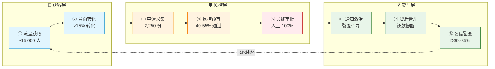
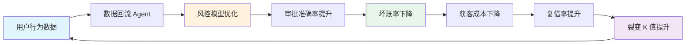
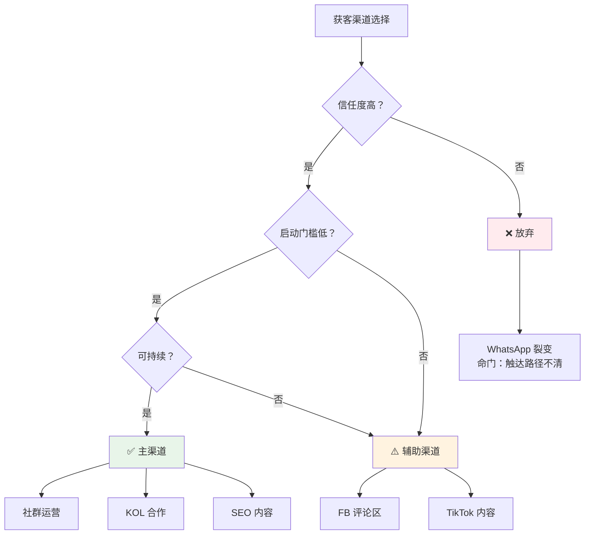

# OFW AI Agent 矩阵 · 业务架构（完整版）

---

## 顶层思考：为什么这样设计业务架构

### 0.1 第一性原理：从本质出发

**在 design 业务架构之前，先回答三个问题：**

| 问题 | 本质 | 答案 |
|------|------|------|
| 我们卖什么？ | 不是贷款，是信任 | OFW 在本地无信用，我们建立信任 |
| 我们赚什么钱？ | 不是利息，是风险定价 | 信息不对称→风险溢价→利润 |
| 我们护城河是什么？ | 不是资金，是数据 | 越用越懂 OFW，越懂越赚钱 |

**结论：业务架构的设计，必须围绕"信任建立"和"数据积累"两个核心。**

---

### 0.2 战略穿透力：点线面体的维度选择

**点（切入点）：为什么选社群/KOL，不选 WhatsApp 裂变？**

| 维度 | 社群/KOL | WhatsApp 裂变 | FB 评论区 |
|------|---------|--------------|----------|
| 信任度 | 高（群内口碑/网红背书） | 中（朋友推荐） | 低（陌生私信） |
| 启动门槛 | 中（需进群/谈合作） | 高（需种子用户） | 低（直接监控） |
| 可持续性 | 高（长期资产） | 中（依赖用户行为） | 低（封号风险） |
| 可控性 | 高 | 低 | 中 |

**核心判断：WhatsApp 裂变的命门是"如何触达新用户"——这个问题没解决，它跑不起来。**

**优先级排序：社群/KOL > SEO > 评论区 > WhatsApp 裂变**

---

### 0.3 真需求三角：价值×共识×模式

**用真需求三角验证每个渠道：**

| 渠道 | 价值 | 共识 | 模式 | 结论 |
|------|------|------|------|------|
| 社群运营 | ⭐⭐⭐ 信任高 | ⭐⭐⭐ 群内口碑 | ⭐⭐⭐ 可持续 | ✅ 真需求 |
| KOL 合作 | ⭐⭐⭐ 背书强 | ⭐⭐⭐ 粉丝信任 | ⭐⭐⭐ 按效果付费 | ✅ 真需求 |
| SEO 内容 | ⭐⭐ 长期资产 | ⭐⭐ 搜索意图 | ⭐⭐⭐ 成本低 | ✅ 真需求 |
| FB 评论区 | ⭐ 精准触达 | ⭐ 信任度低 | ⭐ 封号风险 | ⚠️ 辅助渠道 |
| WhatsApp 裂变 | ⭐ 成本低 | ⭐ 链路长 | ⭐ 触达路径不清 | ❌ 伪需求 |

**结论：WhatsApp 裂变是伪需求——价值、共识、模式三者都不成立。**

---

### 0.4 交互范式转移：AI 时代的流量获取新逻辑

**你之前的洞察："过去人及 APP 时代是和既定的数据规则交互。OpenClaw 来临用户和它交互。"**

**这个范式转移对业务架构的影响：**

| 层次 | 定义 | 对获客的影响 |
|------|------|-------------|
| L1 代理（Agent） | 代表用户执行任务 | 用户可能不直接参与，Agent 代为比较 |
| L2 身份（Identity） | 承载用户偏好、历史、信用 | 服务商需要建立"可信"身份 |
| L3 主权（Sovereignty） | 掌握用户数据、决策权 | 用户数据归属用户，服务商需争取信任 |

**未来获客逻辑：不是获取用户注意力，是获取用户 AI 代理的信任。**

**现在做什么 → 未来价值：**
- 积累 OFW 数据 → AI 代理评估服务商的依据
- 建立服务信誉 → AI 代理选择服务商的依据
- 开发 AI 对话能力 → AI 代理协议的技术基础

---

### 1.1 业务架构的本质是什么

**业务架构 = 流程 × 角色 × 数据 × 规则**

本质是回答四个问题：
1. 业务怎么流转？（流程）
2. 谁做什么？（角色 - Agent/人工）
3. 数据怎么流转？（数据）
4. 什么能做什么不能做？（规则 - 人机边界）

---

### 1.2 AI 时代业务架构的本质变化

| 维度 | 传统业务架构 | AI Agent 业务架构 |
|------|-------------|-----------------|
| **流程** | 人工驱动，线性流程 | Agent 驱动，非线性交互 |
| **角色** | 人是执行者 | Agent 是执行者，人是决策者 |
| **数据** | 结构化数据（表单） | 对话语义数据（意图理解） |
| **规则** | 硬编码规则 | Agent 自适应规则 + 人工兜底 |

**本质变化：从"人执行流程"变成"Agent 执行 + 人决策"。**

---

### 1.3 OFW 信贷业务架构的核心逻辑

**三层逻辑：**

```
第一层：信任建立（获客）
    社群/KOL/评论区 → Agent 触达 → 意图理解 → 信任建立

第二层：风险控制（风控）
    申请采集 → Agent 预审 → 人工复核 → 决策

第三层：价值闭环（贷后）
    放款 → Agent 提醒 → 还款 → 数据回流 → 风控优化 → 获客优化
```

**闭环的本质：信任→风控→价值→信任（飞轮）**

---

### 1.4 业务架构设计的核心原则

| 原则 | 说明 | 案例 |
|------|------|------|
| **信任优先** | 所有设计围绕建立 OFW 信任 | 社群/KOL 为主渠道 |
| **数据闭环** | 每个环节产生数据，数据优化模型 | 数据回流 Agent |
| **人机边界清晰** | 高风险人工，低风险 AI | 终审 100% 人工 |
| **飞轮可自转** | 复借 + 裂变驱动增长 | D30 复借率>35% |
| **风险分层** | 不同风险不同处理 | 规则引擎+ML+ 人工 |

---

### 1.5 为什么 WhatsApp 裂变不能做主渠道？

**深度分析：**

| 问题 | 表现 | 本质 |
|------|------|------|
| **触达路径不清晰** | 老客分享→新客点击→对话（链路长） | 依赖用户行为，不可控 |
| **启动门槛高** | 需要种子用户才能裂变 | 冷启动问题无解 |
| **精准度低** | 朋友推荐不一定有借贷需求 | 需求匹配效率低 |
| **裂变链路不可控** | 用户分享意愿、分享对象不可控 | 无法优化转化率 |
| **封号风险存在** | WhatsApp 对营销消息限制 | 平台政策风险 |

**对比 FB 评论区：**

| 维度 | FB 评论区 | WhatsApp 裂变 |
|------|---------|-------------|
| 触达路径 | 监控帖子→抓取评论者→私信（清晰） | 老客分享→新客点击（链路长） |
| 精准度 | 高（评论借贷内容的人本身有需求） | 中（朋友推荐不一定有需求） |
| 启动门槛 | 低（直接开始监控） | 高（需要种子用户） |
| 可控性 | 高（话术可优化） | 低（依赖用户行为） |

**结论：WhatsApp 裂变优先级低于评论区，因为"如何触达新用户"这个命门问题没解决。**

---

### 1.6 业务架构的终局思考

**3 年后的业务架构会是什么样？**

| 现在 | 3 年后 | 变化 |
|------|--------|------|
| 人→Agent→服务 | 人 AI 代理↔服务 AI 代理 | 用户可能不直接参与 |
| 社群/KOL 获客 | AI 代理推荐 | 获客方式重构 |
| 对话语义数据 | 代理协议数据 | 数据形态变化 |
| 风控模型 | 代理信誉评分 | 风控逻辑变化 |

**现在积累的，是未来的护城河：**
- OFW 用户数据 → AI 代理评估服务商的依据
- 服务信誉 → AI 代理选择服务商的依据
- AI 对话能力 → AI 代理协议的技术基础

**业务架构的设计，必须为未来留接口。**

---

## 一、业务本质

### 信贷的本质

**信贷 = 信任 × 时间 × 风险定价**

| 问题 | 本质 | 本方案答案 |
|------|------|-----------|
| 钱借给谁？ | 风控 | AI预审 + 人工复核 |
| 钱从哪来？ | 资金 | 持牌机构合作 |
| 钱怎么回？ | 还款 | Agent提醒 + 人工催收 |

**获客是入口，风控是命门，信任是底层。**

---

### OFW信贷的本质矛盾

**OFW信贷 = 跨境收入 × 本地借贷 × 信任缺失**

| 现状 | 数据 | 本质 |
|------|------|------|
| 有收入 | 跨境汇款稳定 | 功能价值存在 |
| 无信用 | 本地征信空白 | 共识无法建立 |
| 有需求 | 银行覆盖<40% | 价值未被满足 |
| 无渠道 | 传统获客成本高 | 模式效率低 |

**这个矛盾，就是机会的本质。**

---

### AI在OFW信贷的本质作用

**AI不是获客工具，是信任建立器。**

| 维度 | 传统信贷 | AI Agent信贷 |
|------|---------|-------------|
| 审核方式 | 人工逐单 | AI预审+人工复核 |
| 触达方式 | 广告投放 | Agent主动交互 |
| 数据来源 | 征信报告 | 对话语义数据 |
| 信任建立 | 时间积累 | 意图理解 |

**AI的核心价值：重构信任建立的方式。**

---

### 交互范式的本质转移

**你之前的洞察："过去人及APP时代是和既定的数据规则交互。OpenClaw来临用户和它交互。"**

这个"它"是用户的数字代理（Digital Agent）：

| 层次 | 定义 | 内容 |
|------|------|------|
| L1 | 代理（Agent） | 代表用户执行任务 |
| L2 | 身份（Identity） | 承载用户偏好、历史、信用 |
| L3 | 主权（Sovereignty） | 掌握用户数据、决策权 |

**未来：人AI代理 ↔ 服务AI代理 → 协商 → 交易**

**这个范式转移，是整个业务架构的底层逻辑。**

---

## 二、业务全链路（8步闭环）

### 2.1 流程总览



**Agent 介入说明：**
- 🤖 ①②③④⑥⑦⑧：Agent 全自动（7×24）
- 👤 ⑤ 最终审批：100% 人工（资金安全红线）


---


### 2.2 各环节目标与指标

| 环节 | 目标 | 关键指标 | 健康值 | 警戒值 |
|------|------|---------|--------|--------|
| ① 流量获取 | 月汇入15,000意向用户 | 获客成本/人 | <$2 | >$5 |
| ② 意向转化 | 转化率>15% | 触达→申请转化率 | >15% | <3% |
| ③ 申请采集 | 月均2,250份有效申请 | 信息完整率 | >90% | <70% |
| ④ 风控预审 | 通过率40-55% | 预审准确率 | >85% | <70% |
| ⑤ 最终审批 | 日均30-50笔放款 | 人工审批时效 | <2小时 | >1天 |
| ⑥ 通知激活 | 裂变K值>0.3 | 老带新比例 | >20% | <10% |
| ⑦ 贷后管理 | 还款率>90% | D30还款率 | >90% | <85% |
| ⑧ 复借裂变 | D30复借率>35% | 复借率 | >35% | <20% |

---

## 三、Agent矩阵（12+6个）

### 3.1 原方案12个Agent

| # | Agent | 环节 | 职责 | 技术难度 | 优先级 |
|---|-------|------|------|---------|--------|
| 0 | Agent Manager | 全链路 | 全局调度·定时汇报·策略迭代 | 🟡 中 | Phase 1 |
| 1 | Messenger对话Agent | ①②③ | 被动接待·需求收集·引导申请 | 🔴 高 | Phase 2 |
| 2 | WhatsApp裂变Agent | ①⑥⑧ | 老客邀请·同乡裂变·奖励触发 | 🔴 高 | Phase 3 |
| 3 | 风控预审Agent | ④ | 反欺诈·信用评分·秒级决策 | 🔴 高 | Phase 1 |
| 4 | TikTok内容Agent | ① | 金融教育内容·软性引流 | 🟡 中 | Phase 2 |
| 5 | Facebook社群Agent | ① | 社群监听·内容互动·被动转化 | 🟡 中 | Phase 1 |
| 6 | SEO内容Agent | ① | 借贷攻略内容·长尾关键词 | 🟢 低 | Phase 1 |
| 7 | 被拒留存Agent | ⑥ | 温暖告知·改善建议·3个月再触达 | 🟡 中 | Phase 2 |
| 8 | 贷后管理Agent | ⑦⑧ | 还款提醒·逾期预警·复借引导 | 🟢 低 | Phase 1 |
| 9 | KOL协作Agent | ① | 网红发现·合作洽谈·效果追踪 | 🟡 中 | Phase 2 |
| 10 | 雇主端Agent | ① | 雇主合作·员工推荐·信用背书 | 🟡 中 | Phase 3 |
| 11 | 竞品监控Agent | 全链路 | 竞品动态·价格监控·策略建议 | 🟢 低 | Phase 3 |

---

### 3.2 建议新增6个Agent

| # | 新增Agent | 环节 | 职责 | 技术难度 | 优先级 |
|---|-----------|------|------|---------|--------|
| 12 | 意图分类Agent | ② | 用户需求意图识别 | 🟢 低 | ⭐⭐⭐ |
| 13 | 知识库Agent | ② | 产品FAQ解答（RAG架构） | 🟢 低 | ⭐⭐⭐ |
| 14 | 数据回流Agent | ⑧ | 数据回流优化模型 | 🟢 低 | ⭐⭐⭐ |
| 15 | 情绪感知Agent | ② | 情绪危机检测 | 🟡 中 | ⭐⭐ |
| 16 | LSTM预测Agent | ⑦ | 逾期风险预测 | 🟡 中 | ⭐⭐ |
| 17 | A/B测试Agent | 全链路 | 内容/话术/策略A/B测试 | 🟢 低 | ⭐⭐ |

---

### 3.3 Agent设计的核心思考

**为什么需要这18个Agent？**

| 业务需求 | Agent价值 | 设计逻辑 |
|---------|----------|---------|
| 流量获取效率 | SEO/社群/KOL/评论区Agent | 多渠道协同，降低获客成本 |
| 用户意图理解 | 意图分类/知识库/情绪感知Agent | 理解用户深层需求 |
| 风控效率 | 风控预审Agent | AI秒级决策，人工兜底 |
| 贷后效率 | 贷后管理/LSTM预测Agent | 自动化提醒+风险预测 |
| 数据闭环 | 数据回流/A/B测试Agent | 持续优化飞轮 |
| 系统稳定 | Agent Manager/竞品监控Agent | 全局调度+外部感知 |

**Agent不是工具堆砌，是业务能力的数字化映射。**

---

## 四、各环节Agent介入可行性分析

### 4.1 ① 流量获取环节

**目标：月汇入~15,000意向用户**

#### 渠道优先级排序

| 渠道 | 优先级 | 原因 | Agent可行性 | 封号风险 |
|------|--------|------|------------|---------|
| **社群运营** | ⭐⭐⭐ | 信任度高、合规、长期资产 | FB社群Agent ⭐⭐⭐ | 🟢 低 |
| **KOL合作** | ⭐⭐⭐ | 网红背书、转化高、可控 | KOL协作Agent ⭐⭐⭐ | 🟢 低 |
| **SEO内容** | ⭐⭐⭐ | 长期资产、成本低、稳定 | SEO内容Agent ⭐⭐⭐ | 🟢 低 |
| **FB评论区** | ⭐⭐ | 精准触达有需求用户 | FB社群Agent ⭐⭐ | 🟡 中高 |
| TikTok内容 | ⭐⭐ | 内容门槛、合规风险 | TikTok内容Agent ⭐⭐ | 🟡 中 |
| WhatsApp裂变 | ⭐ | 触达新用户路径不清晰 | WhatsApp裂变Agent ⭐ | 🟡 中 |
| Messenger对话 | ⭐ | 依赖引流、被动接待 | Messenger对话Agent ⭐⭐ | 🟡 中 |
| 雇主端合作 | ⭐ | 门槛高、信任链长 | 雇主端Agent ⭐ | 🔴 高 |

#### 为什么WhatsApp裂变优先级低于评论区？

| 维度 | FB评论区 | WhatsApp裂变 |
|------|---------|-------------|
| **触达路径** | 监控帖子→抓取评论者→私信触达（清晰可执行） | 老客分享链接→新客点击→对话（链路长、不可控） |
| **精准度** | 高（评论借贷内容的人本身有需求） | 中（朋友推荐不一定有需求） |
| **启动门槛** | 低（直接开始监控，无需种子用户） | 高（需要种子用户才能裂变） |
| **可控性** | 高（话术可优化、频率可控制） | 低（裂变链路不可控、依赖用户行为） |
| **风险** | 封号风险高，但有应对策略 | 触达方式本身有风险，且无法解决"如何触达新用户" |

**核心判断：WhatsApp裂变的命门是"如何触达新用户"，这个问题没解决，它根本跑不起来。评论区获客虽然风险高，但至少能精准触达有需求的用户。**

#### 各Agent可行性详细分析

| Agent | 可行性评分 | 核心挑战 | 风险等级 | 建议 |
|-------|-----------|---------|---------|------|
| **SEO内容Agent** | ⭐⭐⭐ 高 | 起量慢（3-6月）、AI内容降权 | 🟢 低 | Phase 1优先，长期资产 |
| **FB社群Agent** | ⭐⭐⭐ 高 | 群组准入、监听效率、被动转化链路长 | 🟢 低 | Phase 1优先，信任度高 |
| **KOL协作Agent** | ⭐⭐⭐ 高 | 网红发现成本、效果追踪、佣金谈判 | 🟢 低 | Phase 2，按效果付费 |
| **FB评论区Agent**（扩展功能） | ⭐⭐ 中 | 话术设计、用户信任度低、可持续性 | 🟡 中高 | 小规模测试，话术优化 |
| **TikTok内容Agent** | ⭐⭐ 中 | 内容本地化、金融广告合规、平台算法 | 🟡 中 | Phase 2，内容门槛 |
| **Messenger对话Agent** | ⭐⭐ 中 | Meta封号风险、被动接待依赖引流 | 🟡 中 | 辅助渠道 |
| **WhatsApp裂变Agent** | ⭐ 低 | 触达新用户路径不清晰、需种子用户 | 🟡 中 | Phase 3，仅作辅助 |
| **雇主端Agent** | ⭐ 低 | 雇主合作门槛高、LinkedIn渗透率低 | 🔴 高 | Phase 3探索 |

---

### 4.2 ② 意向转化环节

**目标：触达→意向转化率>15%**

| Agent | 可行性 | 核心挑战 | 风险等级 | 建议 |
|-------|--------|---------|---------|------|
| **意图分类Agent**（新增） | ⭐⭐⭐ 高 | 意图识别精度>85%，需Fine-tuning | 🟢 低 | Phase 1必备 |
| **知识库Agent**（新增） | ⭐⭐⭐ 高 | FAQ库建设、产品知识结构化 | 🟢 低 | Phase 1必备 |
| **Messenger对话Agent** | ⭐⭐ 中高 | Taglish语言适配、多轮上下文、情绪感知 | 🟡 中 | Fine-tuning+本地词典 |
| **情绪感知Agent**（新增） | ⭐⭐ 中 | 情绪标注数据需求、危机检测 | 🟡 中 | Phase 2 |

**新增Agent设计逻辑：**

| Agent | 为什么需要 | 技术实现 | 数据需求 |
|-------|-----------|---------|---------|
| 意图分类Agent | 用户表达模糊，需要理解真实需求 | NLP分类模型 | 10万+对话语料 |
| 知识库Agent | 用户FAQ高频，需要快速响应 | RAG架构 | 结构化产品知识库 |
| 情绪感知Agent | 用户情绪危机需要人工接管 | 情绪分类器 | 情绪标注数据 |

---

### 4.3 ③ 申请采集环节

**目标：月均2,250份有效申请**

| Agent | 可行性 | 核心挑战 | 风险等级 | 建议 |
|-------|--------|---------|---------|------|
| **申请Agent** | ⭐⭐⭐ 高 | 多轮信息引导、字段完整性 | 🟢 低 | 结构化字段+进度追踪 |
| **文件解析Agent**（OCR） | ⭐⭐⭐ 高 | 菲律宾证件格式适配 | 🟡 中 | 第三方OCR+人工复核 |
| **反欺诈Agent**（活体检测） | ⭐⭐ 中 | 合成身份防御、活体检测准确率 | 🔴 高 | 活体检测+人工复核兜底 |

**技术挑战排序：**

| 挑战 | 难度 | 解法 |
|------|------|------|
| 合成身份欺诈防御 | 🔴 高 | 活体检测+微纹理分析+人工复核 |
| 活体检测准确率 | 🔴 高 | 多因素验证+人工兜底 |
| 证件OCR适配 | 🟡 中 | 第三方OCR+模板匹配 |
| 多轮信息引导 | 🟢 低 | 结构化字段+进度追踪 |

---

### 4.4 ④ 风控预审环节

**目标：预审通过率40-55%**

| Agent | 可行性 | 核心挑战 | 风险等级 | 建议 |
|-------|--------|---------|---------|------|
| **规则引擎**（系统） | ⭐⭐⭐ 高 | 20条硬规则、可解释性 | 🟢 低 | Phase 1主用 |
| **风控预审Agent**（ML） | ⭐⭐ 中 | 替代数据评分、模型冷启动 | 🔴 高 | Phase 2训练 |
| **合成身份检测Agent** | ⭐ 低 | AI生成假脸防御 | 🔴 高 | 人工复核兜底 |

**核心挑战：**

| 挑战 | 原因 | 解法 |
|------|------|------|
| 菲律宾征信数据稀缺 | CIC覆盖率<30% | 替代数据（汇款记录+社交活跃度） |
| 模型冷启动 | 需1,000笔数据训练 | 规则引擎过渡+人工评分 |
| AI决策可解释性 | SHAP值生成 | 规则+ML混合，输出解释 |
| 合成身份欺诈攻击 | AI生成假脸 | 活体检测+人工复核 |

**可行性路径：**

```
Phase 1：规则引擎为主（20条硬规则）
    ↓ 累计1,000笔数据
Phase 2：训练ML评分模型
    ↓ 数据回流优化
Phase 3：替代数据+ML混合评分
```

---

### 4.5 ⑤ 最终审批环节

**目标：日均30-50笔放款**

| Agent | 可行性 | 核心挑战 | 风险等级 | 建议 |
|-------|--------|---------|---------|------|
| **Agent Manager**（审批建议） | ⭐⭐⭐ 高 | AI建议报告、材料打包 | 🟢 低 | 辅助人工 |
| **人工审批** | ⭐⭐⭐ 必须 | 双人审批、资金安全红线 | — | 100%人工 |

**红线：终审放款100%人工，AI仅提供建议报告。**

**为什么必须是人工？**

| 原因 | 说明 |
|------|------|
| 资金安全红线 | AI决策不可完全信任，涉钱必须人工 |
| 合规要求 | 菲律宾SEC要求双人审批 |
| 法律责任 | AI决策无法律主体资格 |
| 用户信任 | 用户需要"人"做最终决定 |

---

### 4.6 ⑥ 通知激活环节

**目标：裂变K值>0.3**

| Agent | 可行性 | 核心挑战 | 风险等级 | 建议 |
|-------|--------|---------|---------|------|
| **通知Agent** | ⭐⭐⭐ 高 | 放款通知、状态更新 | 🟢 低 | Phase 1必备 |
| **被拒留存Agent** | ⭐⭐ 中 | 个性化改善建议、90天培育 | 🟡 中 | Phase 2 |
| **WhatsApp裂变Agent** | ⭐ 低 | 裂变引导、奖励触发 | 🟡 中 | 仅作辅助 |

**被拒留存Agent设计：**

| 功能 | 触达节奏 | 目标 |
|------|---------|------|
| 温暖告知 | D+0 | 情绪安抚 |
| 改善建议 | D+3 | SHAP解释+改善方向 |
| 状态更新 | D+30 | 鼓励持续改善 |
| 再触达 | D+90 | 二次申请邀请 |

**核心价值：被拒用户90天内二次转化率12%。**

---

### 4.7 ⑦ 贷后管理环节

**目标：还款率>90%**

| Agent | 可行性 | 核心挑战 | 风险等级 | 建议 |
|-------|--------|---------|---------|------|
| **贷后管理Agent** | ⭐⭐⭐ 高 | 还款提醒(D-3/D-1)、逾期预警 | 🟢 低 | Phase 1必备 |
| **LSTM预测Agent**（新增） | ⭐⭐ 中 | 逾期风险预测、准确率>75% | 🟡 中 | Phase 2训练 |
| **人工催收**（>30天） | ⭐⭐⭐ 必须 | 严重逾期处置 | — | 100%人工 |

**提醒节奏：**

| 时间节点 | 提醒内容 | Agent负责 |
|---------|---------|---------|
| D-7 | 还款准备提醒 | 贷后管理Agent |
| D-3 | 还款提醒 | 贷后管理Agent |
| D-1 | 最后提醒 | 贷后管理Agent |
| D+1 | 逾期提醒 | 贷后管理Agent |
| D+7 | 逾期警告 | 贷后管理Agent |
| D+30 | 人工催收介入 | 人工 |

---

### 4.8 ⑧ 复借裂变环节

**目标：D30复借率>35%，K值>0.3**

| Agent | 可行性 | 核心挑战 | 风险等级 | 建议 |
|-------|--------|---------|---------|------|
| **贷后管理Agent** | ⭐⭐⭐ 高 | 复借意图识别(D+7) | 🟢 低 | Phase 1必备 |
| **数据回流Agent**（新增） | ⭐⭐⭐ 高 | 数据回流优化模型 | 🟢 低 | Phase 1必备 |
| **风控Agent**（重评） | ⭐⭐⭐ 高 | 个性化额度提升 | 🟢 低 | Phase 2 |

**飞轮加速机制：**

```
每笔还款数据 → 数据回流Agent → 风控模型优化
    ↓
风控准确率提升 → 通过率提升 → 获客成本下降
    ↓
复借引导 → D30复借率>35% → 飞轮自转
```

**数据回流Agent的核心价值：闭环飞轮的技术基础。**

---

## 五、Agent技术难度分级

### 5.1 🔴 高难度（需专项攻关）

| Agent | 挑战 | 解法 | 时间 |
|-------|------|------|------|
| Messenger对话Agent | Taglish语言适配 | Fine-tuning + 本地词典 | 4-6周 |
| Messenger对话Agent | 多轮上下文管理 | RAG + 结构化入库 | 4周 |
| Messenger对话Agent | 情绪感知 | 情绪分类器 + 人工接管 | 6周 |
| Messenger对话Agent | Meta封号风险 | 官方API + 多账号矩阵 | 持续 |
| WhatsApp裂变Agent | 触达新用户路径 | 暂无清晰方案 | — |
| WhatsApp裂变Agent | 裂变链路归因 | 唯一邀请码 + 推荐树 | 2周 |
| 风控预审Agent | 替代数据评分 | 汇款记录 + 社交活跃度 | 8周 |
| 风控预审Agent | 合成身份欺诈 | 活体检测 + 微纹理分析 | 8周 |
| 风控预审Agent | 模型冷启动 | 规则引擎过渡 + 人工评分 | 4周 |

---

### 5.2 🟡 中难度（有成熟方案）

| Agent | 挑战 | 解法 | 时间 |
|-------|------|------|------|
| Agent Manager | 多Agent并发冲突 | 用户锁 + 状态机 | 2周 |
| Agent Manager | 级联故障雪崩 | Circuit Breaker + 多供应商 | 2周 |
| TikTok/FB内容Agent | 内容本地化 | OFW情感元素库 + Few-shot | 3周 |
| TikTok/FB内容Agent | 金融广告合规 | 违禁词库 + 双重审核 | 2周 |
| 被拒留存Agent | 个性化建议 | SHAP解释 + 自动推送 | 3周 |
| LSTM预测Agent | 逾期预测 | LSTM模型 + 人工复核 | 4周 |
| FB评论区Agent | 话术设计 | A/B测试 + 合规审核 | 2周 |

---

### 5.3 🟢 低难度（工程实现）

| Agent | 挑战 | 解法 | 时间 |
|-------|------|------|------|
| SEO内容Agent | 本地关键词挖掘 | Search Console + OFW论坛 | 1周 |
| SEO内容Agent | AI内容质量 | 人工编辑 + 真实案例 | 持续 |
| 申请Agent | 多轮信息引导 | 结构化字段 + 进度追踪 | 2周 |
| 通知Agent | 放款通知 | 模板消息 + 状态更新 | 1周 |
| 意图分类Agent | 意图识别 | NLP分类模型 | 2周 |
| 知识库Agent | FAQ解答 | RAG架构 | 2周 |
| 数据回流Agent | 数据回流 | 自动化管道 | 2周 |
| Agent Manager | 全局调度 | 事件总线 + 任务队列 | 2周 |

---

## 六、人机边界清晰定义

### 6.1 设计原则

**人机边界的本质是：风险分层。**

| 风险等级 | 执行者 | 原因 |
|---------|--------|------|
| 低风险（高频标准化） | 🤖 AI全自动 | 效率优先 |
| 中风险（需判断） | 🤖 AI + 👤人工复核 | 效率+安全平衡 |
| 高风险（涉钱涉法） | 👤 人工必须 | 安全优先 |

---

### 6.2 🤖 AI全自动（7×24）

| 环节 | Agent职责 | 原因 |
|------|-----------|------|
| 流量获取 | 社群监听、内容发布、评论区监控、精准触达 | 高频标准化 |
| 意向转化 | 首次接待、需求了解、产品介绍、FAQ解答 | 高频标准化 |
| 申请采集 | 信息收集、证件OCR、活体检测 | 高频标准化 |
| 风控预审 | 反欺诈检测、信用评分、自动通过/拒绝 | 高频+秒级决策 |
| 通知激活 | 放款通知、被拒留存、90天培育 | 高频标准化 |
| 贷后管理 | 还款提醒、逾期预警、复借引导 | 高频标准化 |
| 数据运营 | 实时报表、竞品监控、数据回流 | 高频标准化 |

---

### 6.3 👤 人工必须操作

| 环节 | 人工职责 | 原因 |
|------|---------|------|
| **最终审批** | 放款双人审批 | 资金安全红线 |
| **资金操作** | 操作资金系统打款 | 合规要求 |
| **风控复核** | 灰色案件最终复核 | AI决策不可完全信任 |
| **投诉处理** | 客户投诉、法律纠纷 | 情绪复杂、法律责任 |
| **逾期处置** | 逾期处置方案决策（>30天） | 重大损失风险 |
| **策略调整** | 风控规则、利率策略调整 | 战略决策权 |
| **监管合规** | 监管报送、牌照维护 | 法律责任 |

**红线：终审放款100%人工。**

---

## 七、核心结论

### 7.1 Agent介入可行性总评

| 环节 | Agent可行性 | 核心瓶颈 | 建议 |
|------|------------|---------|------|
| ① 流量获取 | ⭐⭐⭐ 高 | 平台政策、渠道选择 | SEO/社群/评论区优先，WhatsApp裂变最低 |
| ② 意向转化 | ⭐⭐⭐ 高 | 语言适配、情绪感知 | 新增意图/知识库Agent |
| ③ 申请采集 | ⭐⭐⭐ 高 | 合成身份防御 | 人工复核兜底 |
| ④ 风控预审 | ⭐⭐ 中 | 模型冷启动 | 规则引擎过渡 |
| ⑤ 最终审批 | ⭐⭐⭐ 必须人工 | 合规红线 | AI建议+人工审批 |
| ⑥ 通知激活 | ⭐⭐⭐ 高 | 裂变K值 | 被拒留存Agent重点 |
| ⑦ 贷后管理 | ⭐⭐⭐ 高 | 逾期预测准确率 | LSTM模型+人工催收 |
| ⑧ 复借裂变 | ⭐⭐⭐ 高 | 飞轮启动门槛 | 数据回流Agent闭环 |

---

### 7.2 渠道优先级最终排序

| 优先级 | 渠道 | Agent | 原因 |
|--------|------|-------|------|
| ⭐⭐⭐ | 社群运营 | FB社群Agent | 信任度高、风险低、可持续 |
| ⭐⭐⭐ | KOL合作 | KOL协作Agent | 网红背书、转化高、可控 |
| ⭐⭐⭐ | SEO内容 | SEO内容Agent | 长期资产、成本低、稳定 |
| ⭐⭐ | FB评论区 | FB社群Agent（扩展） | 精准触达、成本低、风险可控 |
| ⭐⭐ | TikTok内容 | TikTok内容Agent | 内容门槛、需合规 |
| ⭐ | Messenger对话 | Messenger对话Agent | 依赖引流、被动接待 |
| ⭐ | WhatsApp裂变 | WhatsApp裂变Agent | 触达新用户路径不清晰、最低优先级 |
| ⭐ | 雇主端合作 | 雇主端Agent | 门槛高、信任链长 |

**核心判断：WhatsApp裂变优先级低于评论区，因为触达新用户的路径没解决。**

---

### 7.3 业务架构的核心洞察

**业务架构的本质：信任→风控→价值的闭环飞轮。**

```
信任建立（获客）
    ↓ 社群/KOL/评论区Agent
风控决策（风控）
    ↓ AI预审+人工复核
价值交付（放款）
    ↓ 通知Agent
价值回收（还款）
    ↓ 贷后Agent
数据回流（闭环）
    ↓ 数据回流Agent
信任增强（复借裂变）
    ↓ 飞轮加速
```

**Agent矩阵的本质：把业务能力数字化，让飞轮能自动转。**

---

**文档版本：v1.0**
**最后更新：2026-04-15**
---

## 附录：核心架构图

### A.1 Agent 矩阵全景图

```mermaid
graph TB
    subgraph 获客 Agents["📢 获客层 Agents"]
    A1[SEO 内容 Agent]
    A2[FB 社群 Agent]
    A3[KOL 协作 Agent]
    A4[TikTok 内容 Agent]
    A5[FB 评论区 Agent]
    end
    
    subgraph 转化 Agents["💬 转化层 Agents"]
    B1[意图分类 Agent]
    B2[知识库 Agent]
    B3[Messenger 对话 Agent]
    B4[情绪感知 Agent]
    end
    
    subgraph 风控 Agents["🛡️ 风控层 Agents"]
    C1[风控预审 Agent]
    C2[申请 Agent]
    C3[文件解析 Agent]
    C4[反欺诈 Agent]
    end
    
    subgraph 贷后 Agents["💰 贷后层 Agents"]
    D1[贷后管理 Agent]
    D2[LSTM 预测 Agent]
    D3[被拒留存 Agent]
    D4[数据回流 Agent]
    end
    
    subgraph 支撑 Agents["⚙️ 支撑层 Agents"]
    E1[Agent Manager]
    E2[A/B 测试 Agent]
    E3[竞品监控 Agent]
    end
    
    获客 Agents --> 转化 Agents
    转化 Agents --> 风控 Agents
    风控 Agents --> 贷后 Agents
    支撑 Agents -.-> 获客 Agents
    支撑 Agents -.-> 转化 Agents
    支撑 Agents -.-> 风控 Agents
    支撑 Agents -.-> 贷后 Agents
    
    style 获客 Agents fill:#e1f5fe
    style 转化 Agents fill:#fff3e0
    style 风控 Agents fill:#ffebee
    style 贷后 Agents fill:#e8f5e9
    style 支撑 Agents fill:#f3e5f5
```

---

### A.2 人机边界图

```mermaid
graph LR
    subgraph AI 全自动["🤖 AI 全自动 7×24"]
    A1[流量获取]
    A2[意向转化]
    A3[申请采集]
    A4[风控预审]
    A5[通知激活]
    A6[贷后管理]
    A7[数据运营]
    end
    
    subgraph 人工必须["👤 人工必须"]
    B1[最终审批<br/>双人审批]
    B2[资金操作<br/>打款]
    B3[风控复核<br/>灰色案件]
    B4[投诉处理<br/>法律纠纷]
    B5[逾期处置<br/>>30 天]
    B6[策略调整<br/>风控规则]
    B7[监管合规<br/>牌照维护]
    end
    
    A4 -->|建议报告 | B1
    B1 -->|审批通过 | B2
    A4 -->|灰色案件 | B3
    
    style AI 全自动 fill:#e8f5e9,stroke:#2e7d32
    style 人工必须 fill:#ffebee,stroke:#c62828
```

---

### A.3 数据回流飞轮



---

### A.4 渠道优先级决策树



---

**文档版本：v2.0（Mermaid 可视化增强版）**  
**最后更新：2026-04-15**
